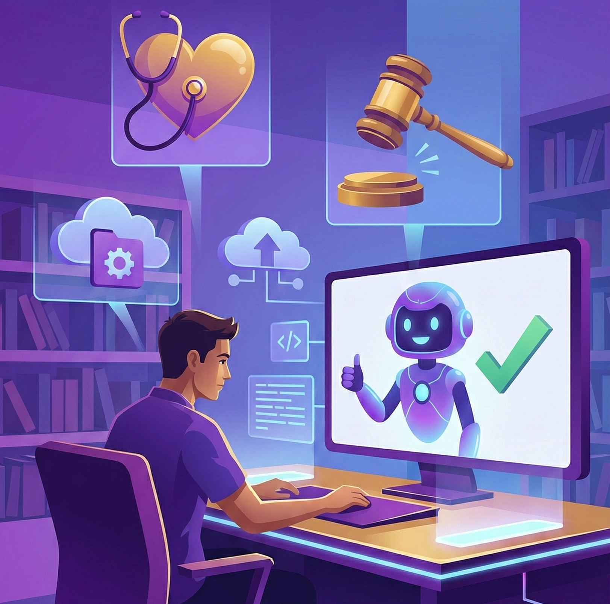
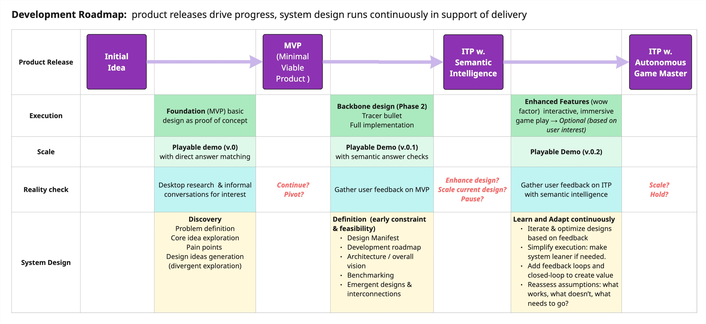

#  Semantic Verification Engine 

### End-to-End system &nbsp; : &nbsp;&nbsp; Synthetic Data Generation → Context Layer → Runtime Application &nbsp;&nbsp;

> **TL;DR — Overview** 
>
>This project is an end-to-end AI engineering case study that builds a **Semantic Verification Engine** using a constrained trivia game as the reference implementation. 
>
>It demonstrates AI system design where **correctness, latency, and cost predictability** are the key drivers. The system separates heavy AI work offline (synthetic data generation, validation, enrichment) and serves a lightweight, CPU-only runtime optimized for fast, controlled interactions.  
>
> → Readers short on time can treat this README as an executive summary.  
> → Deeper documentation captures design reasoning and trade-offs explicitly, tracking iterations and system evolution.

---

### 🔗 Quick Links
&nbsp;&nbsp;
[-9370DB?style=for-the-badge&logo=markdown&logoColor=white)](src/HPtrivia_game/)&nbsp;&nbsp;

---

## 🔎 Project Goal
### Reference Implementation:&nbsp; Harry Potter Trivia Game

🎯 Build an **intelligent trivia system optimized for a constrained problem space** where correctness, latency, and cost efficiency matter more than open-ended conversation. 

As the game evolved, it became clear that the underlying architecture maps to broader problems in semantic verification and controlled AI. These act as sanity checks to ensure the system stays generalizable and not-overfitted to Harry Potter content.

>➡️ **Current State**: 
>- Actively developing Phase 2 (core design). 
>- A [playable demo](#️-quick-start-links) of Phase 1 CLI-MVP with exact answer matching with a is available. 
>- An automated Prefect question-generation pipeline is under active testing;
> - semantic intelligence and SLM integration are planned incremental upgrades.

## 🔎 Design Approach

**Why build a complex system for a simple game?** This project is an architectural case study serving two parallel goals: validating the idea of **speed through rigour** and **accelerating my own learning**. I am explicitly prioritizing depth here, investing in the *meta-work* of rigorous design now to ensure velocity in future projects. To achieve this, the project compresses several learning objectives into an end-to-end platform to see how they interact within a single product:

1. **Data Science (the core)**: Hands-on exploratory data analysis (EDA), contextual feature engineering, semantic similarity evaluation, and select fit-for-purpose NLP techniques.
2. **System Design (the blueprint)**: Translating the data science insights into architectural constraints and viable trade-offs.
3. **MLOps & Agile (the execution)**: Evolving those constraints into a resilient platform, iteratively.

The architecture is stress-tested against real-world constraints (cost, scale, latency, and operations). The goal is not production readiness, but a validated design approach grounded in realistic trade-offs and aligned with **[established architectural patterns 🏛️✨](docs/00_DESIGN_DOC_AND_ARCHITECTURE.md#4-technical-architecture--pattern-mapping)**.

**💡 The Interdisciplinary Lens**. This project explores a set of questions that emerged naturally during development:
- **How do Front-End Loading (FEL) and Agile actually work together?** FEL is the industrial equivalent of *Design Doc / RFC* phase (rigorous definition before execution to mitigate risks and costs). The question is *where does this prevent costly rework and where does it become friction that slows delivery?*
- **Are systems thinking and conceptual process design fundamentally similar?** Both aim to define constraints early, reason about flows, and reduce downstream failure. The similarities are explored and applied here.

**Context**: Coming from a chemical engineering background, I have seen the value of rigorous upfront design in high-risk systems, but I am also aware of its limitations (rigidity, slow feedback). This project deliberately plays with that tension to demonstrate how disciplined systems thinking can **support** fast, iterative delivery rather than compete with it.

## ⭐️ What is the Semantic Trivia Engine (SVE)? 

Using the *Harry Potter Trivia Game* as the reference implementation, the SVE demonstrates how content generation can happen offline while the application runtime focuses on fast, controlled interactions. This keeps the experience responsive, predictable, and cost-efficient, even as advanced features (like in-game AI interactions) are introduced. The platform is built around three core subsystems:

1. **Content Factory**: ingests raw text (Harry Potter books) and manufactures high-fidelity synthetic datasets using autonomous pipelines,
2. **Context Refinery**: A semantic processing and feature engineering layer with  that enriches the dataset with descriptive and contextual, thematic features.
3. **Runtime Environment**: an immutable (offline-capable) container that serves the game (and will later also host the local SLM).

**Figure 1**: The main deployment specification. This schematic represents the backbone of the SVE demo (other phases represent feature additions and upgrades). 

- **Architecture**: See the [Design Doc](docs/00-project_strategy/02-architecture_decisions.md) for detailed data flow schemes for the *Content Factory* and *Runtime Environment*. It also provides the Basis for Design, architectural details for the other phases, and ADRs. 
- **Execution**: See the [Development Roadmap](#-development-roadmap) and the [Detailed Workflow](docs/00-project_strategy/03-detailed_workflow_rev6.md) for the Agile execution strategy with release milestones for the game.
 

## ⭐️ Design Responses to Common GenAI Failure Modes

This project was designed to address anticipated hurdles through an iterative, hybrid approach. It combines limited **Front-End Loading (FEL)** for upfront system design with **Agile sprints** to maintain development momentum and adaptability.

| Design area | Typical failure mode | Design response in Project |
|-|-|-|
|Data Quality|Models trained on messy data hallucinate.|**Layered defenses**. Implemented a 3-tier quality strategy: *prevention* (schemas/prompts), *detection* (automated QA pipeline), and *correction* (adaptive acceptance sampling; user feedback at scale ). The QA pipeline enforces semantic deduplication, hallucination checks to strictly gatekeep the "Gold" database |
|Unit Economics|API costs scale linearly.|**Fixed-cost edge serving**. Fixed API calls are decoupled from runtime in made in limited batches; fixed-cost local CPU container.|
|Reliability|LLMs represent probabilistic truth.|**Architectural decoupling & grounding.**  1. **Structural**: Decoupled runtime environment separates generation from consumption; Content Factory failures cannot crash the game. 2. **Semantic**: Content Factory logic forces strict source-text grounding, ensuring answers come from source books and not the model's training data.|
|Compute|Reliance on expensive GPUs.|**CPU-optimized delivery**: viably run game (later with a quantized SLM) on standard free-tier hardware|
|Operations|*Human-in-the-loop* needs slow scaling|**Autonomous ETL**.  Raw book text is automatically processed into high-quality structured JSON assets, removing the need for manual cleanup or curation.|
|Integration|Complex dependencies break systems.|**Immutable runtime infrastructure**. runtime system isa a self-contained Docker artifact.|

## ⭐️  Key Differentiators

1. **The Content Factory**: The automated data generation and enrichment process has several benefits.
    - **Strategic compute allocation**: GenAI is used only for high-value batch processing, not expensive realtime queries.
    - **Extensible enrichment framework**: The system is designed to support modular expansion without structural refactoring. The Context Refinery provides a centralized enrichment layer with a clear path to formalize it as a Feature Store. New attributes, such as persona-driven hints or trivia fun facts, can be added incrementally to existing records via the proposed enrichment pipeline. All feature additions flow through a single, governed ingestion path to the Gold Dataset, preserving data integrity and semantic consistency as the system evolves.
    - **Dual-product generation**: With careful upfront design, the Content Factory exhibits an emergent property. Creating the game content (trivia dataset) simultaneously produces the *instruction-tuning corpus* for the SLM. Tone, persona, and response style are specified directly in the pipeline schemas and manifests. This enables zero-cost *style distillation* so the AI Persona tone naturally matches the content without separate labeling or post-processing.
2. **Hybrid Intelligence Architecture**: 
    - **High perceived intelligencee / low compute**: in the final envisioned design (phase 3), the runtime decouples knowledge (dataset) from reasoning (SLM acting as both Persona and Judge). This uses knowledge distillation (Teacher-Student training) to ensure the small model mimics the wit and logic of a large LLM without the compute cost.
    - **No hallucination at runtime**: by retrieving answers from disk rather than generating using GenAI API calls at runtime. This avoids cases where the model produces responses that *sound* correct but are factually invented (e.g. a plausible-sounding but nonexistent Harry Potter question).
 

## ⭐️  Adaptation & Use Cases
While SVE is demonstrated here as a trivia game, the architecture can be generalized as a domain-agnostic *knowledge distillation engine*. It solves the problem of last mile knowledge delivery by taking dense, static documentation (e.g. pdfs, wikis, manuals) and converting it into an interactive, gamified mastery tool. Some example use cases:

||**EdTech & Test Preparation**|**Enterprise Onboarding & Compliance**|**Technical & Product Training**|
|-|-|-|-|
|| | | |
|*Problem*|Students studying for the MCAT (or Bar exam, AWS cert) need high-quality drills, but generic LLMs hallucinate specific details (e.g., medical dosages).|Nobody really reads the 50-page employee handbook or the safety protocol PDF|Sales teams struggle to memorize the specs of new complex hardware/software products|
|*Input*|medical textbooks| safety manual pdfs|A corpus of product specification sheets|
|*Context Refinery Logic*|Extract `Anatomy`, `Conditions`, `Treatments`| Extract `Risks`, `Protocols`, `PPE`|Extract `Specs`, `Compatibilities`, `Competitor Differentiators`|
|*Data Generation w. Context*|Generate rigorous case-study questions grounded in the text, grouped by topic|Extract safety rules into *scenario questions* with strict answer keys|Convert technical specs into comparative scenario questions (e.g., 'Which product fits this constraint?')|
|*Output*|An "Offline Tutor" that quizzes students and explains why an answer is wrong using the "Gold" explanation field|A gamified *safety certification* app running locally on company tablets|A mobile-friendly web app for the sales team to play during downtime|
|**Why it wins** 🏆| *Accuracy*. The hybrid architecture ensures the answer key is 100% textbook-correct (database) while the Persona (SLM) acts as an empathetic tutor|1. *Privacy*: The local SLM provides local inference; no proprietary company data is sent to a third-party (e.g Open AI or Google).  2. *Cost*: Deployed to 10,000 employees for the fixed cost of hosting the container (or $0 if running on employee laptops).| *Speed*. The *Content Factory* allows the training team to spin up a new training module in hours (run the pipelines) rather than weeks of manual course design|
 

## 📝  Lessons Learned 

This project evolved from a technical demo into an architectural case study, using the tension between Systems Thinking (rigour) and Agile Delivery (speed) as the primary lens for design decisions. 
✨ Core takeaway: **Architecture provides the direction, delivery determines the priority.** ✨

<b>Expand to read the key takeaways</b>

### 1. Systems thinking sets the constraints, Agile validates the value.
Defining constraints early (Front-End Loading) helped avoid architectural dead-ends. However, design alone risks building a solution that has no market fit. 
✨ **Takeaway**: Systems thinking gives direction, but Agile is the determines progress. The most effective approach is to use a reasonably rigorous design to frame the problem then use iterative delivery to solve it.

### 2. Complexity must be *earned*.
Over-engineering is contextual. Deep investment in the Content Factory was important because it is critical to the core value proposition (trustworthy data). 
✨ **Takeaway**: Early rigour is for foundational risks. Additional complexity (e.g. Personas) must be earned through user feedback.

### 3. Domain constraints define architecture
This project reinforced that a specific problem (finite, authoritative trivia) requires a different approach than a general-purpose solution. A standard "LLM-first" design (like a real-time chatbot) would have failed the strict latency and correctness requirements. 
✨ **Takeaway**:  Effective engineering means applying the tool (LLM) to solve a specific problem rather than designing the system around the tool. For this domain, correctness and predictable costs mattered more than open-ended generation.

### 4. The value of interdisciplinary engineering
Applying Chemical Engineering principles (safety, process limits) brought necessary discipline to the AI workflow. 
✨ **Takeaway**: Traditional engineering rigour adds significant value but it *must* be adapted for speed, not transplanted wholesale. The goal is to blend the discipline of heavy industry with the velocity of software.

### 5. Convergent evolution where constraints drive standards.
I didn't explicitly set out to implement complex patterns like the *medallion architecture* or *CQRS*. These patterns emerged organically as the necessary solutions to bottlenecks in latency and data integrity. Once I recognized a pattern I used it to harden my design. For example, adopting a centralized *Feature Store* mindset for the Context Refinery led to:
- **Centralized feature engineering**: Moving all descriptive feature extraction from the Content Factory `qa_validation` pipeline to the Context Refinery ([ADR-P2-XX]()). 
- **Precomputed feature lookups**: Implementing a lookup approach for SBERT deduplication, which further decoupled the subsystems and streamlined the logic and making the Context Refinery Refinery the single source of truth for the game's intelligence (NER, embeddings, topic tags) (see [ADR-P2-XX]()).
- **Designing for easy upgrades**: Leveraging the feature lookup pattern to then seamlessly "hot-swap" pretrained embeddings with fine-tuned embeddings once the domain-specific model is ready([ADR-P2-XX]()) 

✨ **Takeaway**: Realizing that my solution matched existing industry patterns was validating. Going forward, my workflow is to solve the immediate problem using first principles, then identify the underlying core pattern to verify and harden the design. This ensures the architecture is robust and fit-for-purpose.

### 6. Process Integration leads to emergent design.
Viewing *system design* through the lens of *conceptual process design* revealed that single components could solve multiple problems (*process integration*). For example, the Gold dataset was designed not just for game logic but also a pre-structured training corpus for future SLM fine-tuning. 
✨ **Takeaway**: Process design principles can unlock hidden efficiencies. By anticipating downstream needs, we can create dual-purpose assets and defensive layers that optimize both immediate performance (cost/latency) and future scalability.

### 7. Conceptual design and systems thinking
The initial design relied on conceptual system design: reasoning about the system as a whole through constraints, trade-offs, and static snapshots (e.g. scale, throughput, lifecycle). In chemical engineering, these conceptual designs are later stress-tested through sensitivity analysis and dynamic simulation during FEED (the next waterfall design stage) to understand system behavior over time. In this project, systems thinking plays a similar role at a higher level, allowing end-to-end dynamic behavior (feedback, amplification, delays) to be reasoned about conceptually, without immediately resorting to formal simulation.

✨ Takeaway: Conceptual design defines a solution under real constraints; systems thinking extends this by assessing whole-system dynamic behavior early. This mirrors established chemical engineering practice, but provides a lightweight, architecture-level way to reason about dynamics that translates well to AI systems.

## 🏁 Development Roadmap

The roadmap below visually demonstrates how product delivery, Agile execution, complemented with system design thinking are used together in the project development. This hybrid approach is a synthesis of the lessons learned in this project.

<b>Expand to see the Roadmap</b> 

**Figure 2**: Development roadmap showing how product releases drive execution while system design runs continuously in support of delivery.

>**Note-1: (*Reality Checks*)**  
>The “Reality Check” points shown in roadmap are **not formal decision gates**. They are lightweight, iterative feedback checkpoints used to validate assumptions and inform the *next iteration*. Product delivery continues; these checks guide adaptation, not approval.
>
>**Note-2: (*Documents for the "definition" stage*)** 
>In a production setting, many of these artifacts would be lighter or merged. Here they are explicitly to explore and synthesize ideas, comparisons, and architectural validation.

The planned releases are:

|Release| MVP | ITP with Semantic Intelligence | ITP with Autonomous Game Master| 
|-|-|-|-|
|version| 0 | 0.1| 0.2|
|Architecture|Docker + FastAPI + Static SQLite (Manual Data)|Docker + FastAPI + Gold Dataset (Auto-Generated) + SBERT|Docker + FastAPI + SQLite + Quantized SLM.|
|Answer checking logic|Exact string matching|Hybrid answer checking (Direct $\rightarrow$ Fuzzy $\rightarrow$ SBERT embedding similarity)| SLM judge for ambiguous similarity scores. Hybrid answer checking (Direct $\rightarrow$ Fuzzy $\rightarrow$ SBERT $\rightarrow$ SLM)|
|Goal|Deploy game with playable URL for early feedback|Upgrade MVP fragility with core design|Persona & Judge injection. Prove Edge AI feasibility|

## 🛠️ Project Status

This project follows a data-centric AI lifecycle. Development is currently in Phase 2 (adding semantic intelligence), having completed phase 1 (discovery and foundation). Refer to [workflow](docs/00-project_strategy/03-detailed_workflow_rev6.md) for the sprint breakdown.

**✅ Phase 1: Data Science Discovery & Game Foundation &nbsp;&nbsp;&nbsp;[COMPLETE]** 
Focused on Exploratory Data Analysis (EDA), processing & feature engineering, schema definition of the raw dataset and CLI-MVP development. 

<b>Click to expand Phase 1 data engineering & MVP metrics</b>

### Phase 1 focused on discovery & prototyping
The raw dataset was manually curated and standardized to build the Baseline (v0) dataset. This manual process exposed the scalability bottlenecks that directly informed the [Content Factory architecture](docs/00-project_strategy/02-architecture_decisions.md#p2-content-factory-architecture-in-depth) for Phase 2.

|Metric|Value|Description|
|:-:|-|:-|
|Data Optimization|1279 → 902|Aggressive pruning (Q-Q cosine similarity) + Strategic Enrichment (100+ new explanatory items, 240+ rehabilitated)|
|Topic Diversity|86% unique|Answer-Answer (A-A) analysis confirmed high semantic variety, limiting repetition to core entities.|
|Taxonomy (interrogative identifier)|100%|Achieved complete categorization coverage using a custom tokenizer & lemmatization script. This is important because it is used to classify questons into the main types (Explanatory, Factual-Recall, Mulitple-Choice, Yes/No)|
|Class Balance|`Baseline_v0`|78% Factual Recall, 11% Explanatory, 10% MCQ, 1% Yes/No.|
|Schema Validation|	Pass	|Ingestion script with standardized schema checks, automated deduplications minimized error when appending to the main dataset|
|Game Core|	MVP	|Python MVC (Model-View-Controller) Architecture w/ pytest coverage|

#### Key Analytical Insights
* **Linguistic id:** Answer length can be used to distinguish between Explanatory (EX) from other short-answer types (FR, MCQ, YN). The [boxplot analysis](#c-box-plot-of-answer-length-vs-question-type-baseline-v0-dataset) shows the the interquartile range for EX answers (8-22 words) does not overlap with FR, MCQ, or YN.
    * *Architectural Implication:* Phase 2 monitors answer-shape patterns as the dataset grows to preserve consistency across question types. See [ADR-P2-014](docs/adrs/ADR-P2-014.md) for the full rationale and monitoring approach.
- **Vector drift**: The TF-IDF vectorizer struggled with the vocabulary shift introduced by new *explanatory* (EX) questions, directly motivating the switch to Sentence-BERT (SBERT) for Phase 2 deduplication.
- **Question-type imbalance**: The baseline dataset was heavily skewed toward Factual Recall (78%). This imbalance drove the requirement for the Phase 2 *Content Factory* to synthetically generate complex "Why/How" questions. These type of questions are key differtiators for the game experience. It should also be able to generate the other question types to keep dataset in balance.

#### Architecture emergence (Learnings)
The Phase 2 ACES Medallion architecture (Bronze/Silver/Gold) was not pre-planned; it emerged as the necessary solution to the bottlenecks discovered during Phase 1:

|Layer|Phase 1 Discovery (The Problem)|Phase 2 ACES Solution|
|-|-|-|
|Bronze (Generation)|Manual curation of raw dataset required deleting 57% of data due to quality issues (duplicates, errors)|LLM model (Gemini): add synthetic high-quality question generation via the `question_generation` pipeline, also allows balancing question type variety. Legacy data is rehabilitated via `data_enrichment` pipeline.|
|Silver (Validation)|Simple string matching failed to catch semantic duplicates (phrasing variations) causing bloat.|Semantic gates (SBERT): Decoupled validation into a `qa_validation` pipeline using Sentence-BERT for semantic deduplication and hallucination checks.|
|Gold (Ingestion)|Validation and ingestion scripts were tightly coupled which would be difficult to manage as more validation logic is added.|Lightweight ingestion: Separated final commit logic into a `data_ingestion` pipeline, ensuring only "gold-grade" data is versioned (DVC) and deployed.|

#### Phase-1 Visual Artifacts

1. **Interrogative keyword distirbution (100% coverage)** 
    

    
<b>🔎 View the keyword distribution plot</b>

    
    *(Click image to open full resolution)*
    

     

2. Baseline v.0 dataset status map 
    

    
<b>🔎 View Baseline v0 Status Map</b>

    
    *(Click image to open full resolution)*
    

3. **Box plot of Answer Length vs. Question type (Baseline v.0 dataset)**
    

    
<b>🔎 View the keyword distribution plot</b>

    
    *(Click image to open full resolution)*
    

#### Key Discovery Artifacts (Phase-1)

› [[Cleaning & EDA notebook](notebooks/02_research/01_cleaning_and_eda.ipynb)] → Length, distribution, n-gram analysis, custom tokenizing. 
› [[Processing & Feature Eng. notebook](notebooks/02_research/02_eda_and_deduplication.ipynb)] → Semantic deduplication, feature engineering, quality-assurance strategy, readability analysis.

 

**🚧 Phase 2: Operationalize core design &nbsp;&nbsp;&nbsp;[ACTIVE]** 
Create the design operational backbone (all three subsystems: Content Factory, Context Refinery, Runtime Environment) leveraging phase 1 components and learning.

 - ☑️ Prompt engineering experimentation is complete (confirmed generation and validation of high-quality question generation with LLM API calls). 
    - *refer to [Strategy Doc](notebooks/02_research/03_aces_generating_new_questions/03-0_prompt_eng_strategy.ipynb) and [PE Experimentation Notebook](notebooks/02_research/03_aces_generating_new_questions/03-1_prompt_eng_experimentation.ipynb)*.
 - ☑️ Architectural design, design manifest, execution plan and updated workflow are complete. 
    - *refer to [Project Strategy Docs](docs/00-project_strategy/)*.
 - 🔲 **Tracer Bullet implementation**: End-to-end skeleton code is currently being drafted.
 - 🔲 **Pipeline orchestration**: Prefect `question_generation` flow is built and undergoing active testing. 

## 🚏 How to Navigate This Project

To understand the **Systems Thinking** behind ACES, it is recommended to explore the repository in this order:

1.  **The Blueprint (Architecture):** Start with the **[`Design Doc`](docs/00_DESIGN_DOC_AND_ARCHITECTURE.md)** to see the design basis, and architectural details (e.g. runtime environment design, pipeline arrangments within the Content Factory), and ADRs.
2.  **The Process (Workflow):** Read **[`execution plan`](docs/01_EXECUTION_PLAN.md)** to understand the iterative use FEL, sprints, and tracer bullets to balance rigour and delivery momentum in the project.
<!--3.  **The Implementation (Demos):** Visit **[`demos/`](demos/)** to watch the CLI-MVP failure points and Content Factory pipeline demos (e.g. question generation)-->
3.  **The Code (Implementation):** Finally, explore **[`src/`](src/)** to see the modular game code. And [`scripts`](scripts) for pipeline orchestration.

## 🛠️ Tech Stack
*The following stack represents the complete Target Architecture (Phase 1–4). Technologies currently in integration testing are marked with \*\*.*

<b>Click to expand and read the tech stack details</b>

| Category | Technologies | Architectural Role |
| :--- | :--- | :--- |
| **Languages** |  \*\* | **Core Logic:** Python handles the orchestration pipelines and runtime server; SQL handles high-speed knowledge retrieval. |
| **Frameworks & Libraries** |   \*\*  \*\* | **Orchestration & interface:** *Prefect* manages workflows, *Pydantic V2* enforces quality gates, *pytest* validates logic, and  *Rich* handles structured logging and the CLI interface. FastAPI* serves the runtime. | |
| **NLP & Embeddings** |   \*\* | **Semantic Processing:** SBERT handles semantic search & deduplication; spaCy executes Named Entity Recognition (NER) for fact extraction. |
| **GenAI Components** |  \*\* \*\* | **Hybrid Intelligence:** Gemini (Teacher) generates high-fidelity assets; Quantized SLMs (Student) handle offline edge inference. |
| **Data & Storage** |   \*\*  | **Knowledge Base:** JSONL for raw ingestion (Bronze); Parquet for typed processing (Silver & Gold). |
| **Infrastructure** |   \*\* | **Deployment:** A shared-nothing, immutable Docker artifact. |

<!--### 📦 Key Dependencies
* `google-generativeai`: Client for the "Teacher" model (Content Factory).
* `llama-cpp-python`: Inference engine for the "Student" model (Persona/Judge)/ **
* `sentence-transformers`: Semantic deduplication and hallucination checks (SBERT).
* `pydantic`: Strict schema validation and data quality gates (V2+)**
* `pytest`: Unit and functional testing suite with dependency mocking (API & File I/O). -->

📦 See [requirements.txt](requirements.txt) for packages required to run the game, and [requirements-dev.txt](requirements-dev.txt) for the complete list of tools used in the game as well as notebooks, data processing, and advanced NLP work.

💡 **AI-Augmented Engineering**: This project follows an AI-enhanced workflow. Primarily Google Gemini (2.5 & 3 Pro) acts as a technical thought partner, occasionally supplemented with other models (ChatGPT, Claude).
- *AI-role*: Serves as an architectural sounding board, code reviewer, debugging helper, and documentation aide.
- *Attribution Strategy*: All core architectural decisions, system constraints, and systems thinking logic are developed by the author. The AI is heavily leveraged to accelerate skill acquisition, explaining library specifics, suggesting Pythonic refactors, and reviewing implementation logic.
- *Verification*: To maximize learning retention, the codebase is written by the author under AI guidance. Where specific logic is AI-generated (e.g. pipeline reporting), it is explicitly acknowledged in the source files. <!--The author takes full responsibility for the system's logic and functionality.-->

## ℹ️ Data Sources

For more information on the datasets and all other data types used, please refer to the [Data_Sources.md](DATA_SOURCES.md).

## ℹ️ License

This project's code is licensed under the [MIT License](LICENSE-MIT). See the `LICENSE-MIT` file for details.

<b>Data usage</b>

- *Raw Inputs*: The original raw trivia data used for Phase 1 baseline testing is documented in [Data_Sources.md](DATA_SOURCES.md) and is not redistributed in this repository.
- *Gold Dataset*: The runtime database is a hybrid asset. It consists of the original source data (cleaned, normalized, and validated) augmented with synthetic content and metadata generated via the ACES pipelines. To respect original copyrights, the full gold dataset is not included in this repository.
<!--  *Distribution*: To respect original copyrights, the full "Gold Dataset" is not included in this repository. A small, fully synthetic sample is provided for demonstration purposes under a [CC-BY-NC](https://creativecommons.org/licenses/by-nc/4.0/) (Creative Commons Non-Commercial) license.-->

<!-- ## ℹ️ Acknowledgements
To my daughter — an endless source of joy and inspiration. You brought the *fun* to this project, and are my go-to expert for all things Harry Potter, especially those rapid-fire and obscure references. Thank you for being my alpha/beta tester and ever-patient reviewer!-->

## ℹ️ Disclaimer:
This project is an unofficial fan tribute to the Harry Potter series and is not endorsed by or affiliated with J.K. Rowling, Warner Bros., or any related parties. It is a passion and learning project created solely for educational and non-commercial purposes.