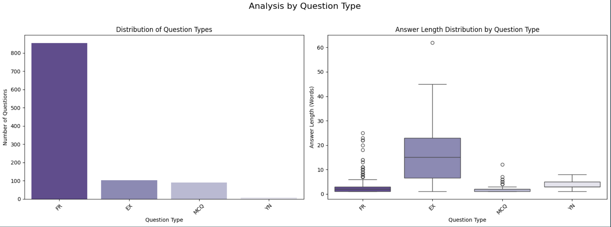

#  NLP Trivia Engine: Semantic Q&A with Custom NER, Sentence-BERT, and Modular Design

*Themed: Harry Potter | CLI MVP → Web App in Progress*

> 🎯 **This project demonstrates applied NLP, semantic search, software engineering, and full-stack thinking — all through an interactive trivia game.**  
>
> It’s both a passion project and a showcase of technical fluency in Python, NLP pipelines, and modular design.

---

## ✨ What Is This?

This magical little adventure started over late-night book readings and a daughter who just won’t stop dropping Harry Potter trivia around the clock. Naturally, a trivia game was born – for her to play, and for me (a muggle-turned-data-wizard) to build.

More than just a game, this project was designed to **apply and demonstrate data and software engineering skills**, including:

- 🐍 Clean Python + OOP design
- 🧠 NLP & custom-entity classes for Named Entity Recognition (NER)
- 🔎 Semantic answer matching with Sentence-BERT embeddings
- ⚙️ Data engineering: schema enforcement and automated reusable pipelines with validation logic
- 🤖 LLM prompt engineering: content generation via API calls to enhance dataset diversity
- 🎯 MVP thinking: CLI → GUI (Flask) → interactive enhancements
- 📦 Modular design, installable packaging
- 🧪 Testing, version control, structured documentation

Whether you're here to cast code spells or just play a few rounds of trivia, welcome to a corner of the internet where passion meets Python.

## Table of Contents

1. [Description](#description)
2. [Development roadmap](#development-roadmap)
3. [Key findings and Outcomes](#key-findings-and-outcomes)
4. [Features](#features)
5. [Tech stack](#️-tech-stack)
6. [Installation](#installation)
7. [Usage](#usage)
8. [Controls](#controls)
9. [Data Sources](#data-sources)
10. [License](#license)
11. [Contributing](#contributing)
12. [Acknowledgements](#acknowledgements)
13. [Disclaimer](#disclaimer)

## Description

Step into the halls of Hogwarts and test your knowledge with this interactive CLI trivia game (and later a web app)! Challenge yourself or compete for house points against a series of randomly selected questions drawn from the wizarding world. This project goes beyond simple Q&A, utilizing Natural Language Processing (NLP) with custom-trained models [Phase 2 onwards] to understand the nuances of the questions and eventually [Phase 4+] even your answers!

## Development roadmap

🚧 This is a work in progress! The main steps in the devleopment of the game are:

1. Phase 1: MVP core game logic, unit testing, and pattern awareness
    - Setup environmental and data foundation (download, cleaning, EDA, preprocessing of dataset)
    - Standardize the dataset and setup a data ingestion pipeline
    - Develop basic core logic and OOP structure for CLI game play (Model-View-Controller pattern).   
    - Test and refactor the game throughly (using unittest and pytest) 🟣 **← Current phase**

2. Phase 2: NLP, NER, Sentence-BERT integration to CLI MVP.
    - Generate ~500 lexically and contextually rich questions using prompt enginnering & API calls
    - Annotation of data, training of NER model with iterative active learning.
    - Static NER tagging
    - Hybrid answer checking using direct and fuzzy matching (for factual types, multiple-choice etc) and sentence-BERT (for explanatory type of questions)
    - Integrate logic into MVP (topic and difficulty level selection)
    - containerize CLI MVP demo and deploy online

3. Phase 3: Basic web app (with Flask)
    - setup and integrate game logic backend with audio and visuals.
    - styling and deployment prep.

4. Phase 4+: Enhancements! (the most exciting part)
    - Tagging reference of q&a to HP book of origin
    - Easter eggs and themed commands / elements
    - GUI and game state enhancements 

5. Future vision / stretch goals: Explore and deploy innovative features, such as an auto-generated trivia mode powered by LLMs.

**Project documentation**:

The project phases and sprints can be found in the detailed workflow document. This is a live, adaptive document to organize work and learning streams of the project.
- [🗂️ Latest Workflow](docs/Overall%20workflow/) — Always updated with the current workflow version.  
- Older versions are archived [here](docs/superceded/) for reference.
- The CLI MVP gameflow is documented in both [flowchart](docs/MVP/MVP_gameflow_v1_flowchart_view.svg) and [text](docs/MVP/MVP_gameflow_v1_text.md) formats.
- See the [Changelog](CHANGELOG.md) for a record of updates and changes.

## Key findings and Outcomes

### Phase 1: MVP Development & Data Analysis Outcomes

#### Data Analysis of the HuggingFace dataset:

This project transformed a raw, publicly sourced dataset of over 1,200 trivia questions into a high-quality, standardized, and feature-rich dataset ready for an MVP game and advanced NLP applications. The initial data contained significant redundancy, formatting inconsistencies, and lore inaccuracies.

Through a comprehensive process of Exploratory Data Analysis (EDA) and data curation, the following key outcomes were achieved:

- **De-duplicated 28% of the dataset**. Reduced dataset from 1,279 to 914 unique questions through a multi-stage de-duplication process, where a deep semantic similarity analysis using TF-IDF, cosine similarity and graph clustering identified an additional ~8% of non-obvious, near-duplicates missed by standard methods.
- **Identified and re-authored all incomplete or flawed questions**, creating dozens of new, high-quality Multiple-Choice, Yes/No, and Factual Recall questions to ensure fairness and lore accuracy.
- **Achieved near-100% classification accuracy** for question types (Factual Recall, Explanatory, etc.) and interrogative keywords by engineering features from tokenized text.
- **Discovered and addressed dataset imbalance** Identifyied there was 97% skew towards factual recall questions, balancing the dataset with new Explanatory and MCQ questions focused on core book lore to improve game variety.

  
  
<em>Figure 1: A snapshot from the project's automated Status Map report, visualizing the more balanced question type distribution in the final, curated dataset. Factual Recall (FR) questions remain the most prominent category, highlighting an opportunity for further expansion.</em>

 

- **Developed a robust automated data ingestion pipeline** based on the *status / payload" pattern with integrated quality checks (schema validation, NaN handling) and a tiered duplicate detection system utilising semantic similarity that can validate and process new, curated questions.
- **Developed reusable analysis tools**. Built a reusable `eda_scripts` module to encapsulate all data processing, analysis, and reporting functions, including a *"Status Map" dashboard* that visualizes the final dataset's composition.
- **Curated the unique questions down to a final, validated MVP dataset of 902 questions.** This process involved extensive domain-specific edits, including re-authoring 203 questions for clarity and replacing over 100 flawed entries with new, lore-accurate MCQs.

The final, curated dataset serves as a strong foundation for the trivia game MVP. The next phase will focus on expanding the dataset with an additional 500+ questions (primarily explanatory type) using a guided AI generation pipeline to showcase advanced semantic NLP capabilities.

#### MVP Development & Testing
- Built CLI MVP with core trivia gameplay, house point scoring, and user interaction. The logic was developed based on the Model-View-Controller (MVC) architectural pattern.
- [Link to CLI Docker container / demo](#) (containerized web deployment of MVP is under development)
- Plan to begin user testing next week, tracking metrics such as:
  - Number of game sessions played
  - User accuracy and response patterns
  - Bug reports and feature requests
- Screenshots of current CLI interface and gameplay experience:

## Features

### Current features:
- **Randomized Trivia Questions**: Every game session is unique.
- **Scoring**: Represent your chosen Hogwarts house and earn house points to find your wizarding trivia rank.
- **Interactive UI**: Command logic interface with dialogue and feedback to create an immersive experience.

### Future features:
- **Custom NER Model**: support topic selection (e.g. characters, locations, spells) and difficulty-level questions in the game based on custom NER class tagging.
- **Conversational play**: semantic-answer checking with sentence-BERT (phase-2), convesational game-play using Distil-BERT.
- **Interactive GUI**: web based up for more player engagement with visuals, audio, and interactive elements.

## 🛠️ Tech Stack

Click to expand

<table>
  <tr>
    <td align="center"><b>Concepts</b></td>
    <td></td>
    <td></td>
    <td></td>
    <td></td>
  </tr>
  <tr>
    <td align="center"><b>Engineering</b></td>
    <td></td>
    <td></td>
    <td></td>
    <td></td>
  </tr>
  <tr>
    <td align="center"><b>Project Status</b></td>
    <td></td>
    <td></td>
    <td></td>
    <td></td>
  </tr>
</table>

The core application is built in Python, following Object-Oriented Programming (OOP) principles for a clean, modular architecture. All Natural Language Processing (NLP) and NER work is prototyped and analyzed in Jupyter Notebooks using libraries like spaCy.

The entire development process is versioned with Git/GitHub and documented in Markdown, with VS Code as the primary editor.

📦 See [requirements.txt](requirements.txt) for packages required to run the game, and [requirements-dev.txt](requirements-dev.txt) for the complete list of tools used in the game as well as notebooks, data processing, and advanced NLP work.

💡 AI-assisted support from ChatGPT 4o (free-tier), and Google Gemini 2.5 Pro was used for brainstorming, project planning and strategizing, code review, ideation, debugging and learning throughout development.

## Installation

This section will provide clear, step-by-step commands to install game once ready.
<steps such as: git clone.. cd.. pip install setup.py... run main.py etc>

## **Usage**

1. When you launch the game, you will be prompted to enter your name and select your Hogwarts house.
2. Answer a series of randomly selected trivia questions about the Harry Potter universe.
3. After each question, you will receive feedback on whether your answer is correct or incorrect.
4. At the end, you'll receive a score and a "Wizard Rank" (e.g., "Harry Potter Expert," "Hogwarts First-Year").

## Controls:
- Type your answer and press **Enter**.
- Type "quit" to exit game at any point.

## Data Sources

For more information on the datasets and all other data types used, please refer to the [Data_Sources.md](DATA_SOURCES.md).

## Licence

This project's code is licensed under the [MIT License](LICENSE-MIT). See the `LICENSE-MIT` file for details.

The trivia data used in this game is sourced from the "saracandu/harry-potter-trivia-human" dataset on Hugging Face (original link: [https://huggingface.co/datasets/saracandu/harry-potter-trivia-human](https://huggingface.co/datasets/saracandu/harry-potter-trivia-human)). While the original dataset link is currently unavailable, a local copy is being used and is believed to be licensed under the [Apache License 2.0](LICENSE-APACHE2). The full text of the Apache License 2.0 can be found in the `LICENSE-APACHE2` file in this repository.

**In summary:** The code for this game is under the MIT License, and the use of the trivia data is subject to the terms of the Apache License 2.0.

## Contributing

We welcome contributions to improve the game! Here’s how you can help:

1. Fork this repository.
2. Create a branch for your feature or bug fix (`git checkout -b feature-name`).
3. Commit your changes (`git commit -am 'Add new feature'`).
4. Push to the branch (`git push origin feature-name`).
5. Open a pull request.

Please follow the [Code of Conduct](CODE_OF_CONDUCT.md) and ensure your changes are well-documented.

## Acknowledgements
To my daughter — an endless source of joy and inspiration. You brought the *fun* to this project, and are my go-to expert for all things Harry Potter, especially those rapid-fire and obscure references. Thank you for being my alpha/beta tester and ever-patient reviewer!

## Disclaimer:
This project is an unofficial fan tribute to the Harry Potter series and is not endorsed by or affiliated with J.K. Rowling, Warner Bros., or any related parties. It is a passion and learning project created solely for educational and non-commercial purposes.
