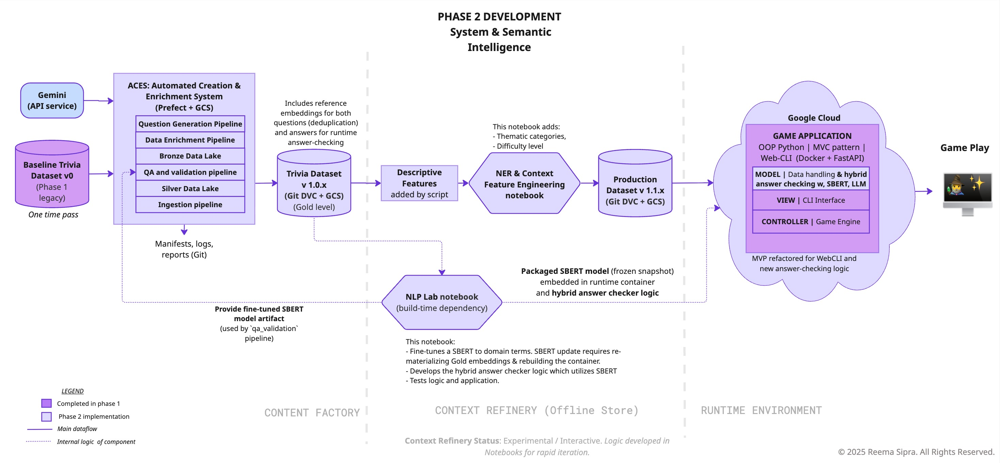
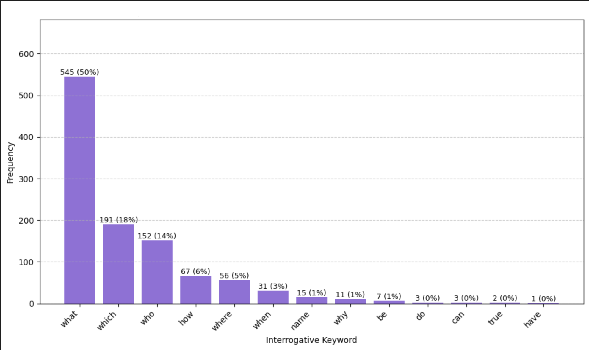
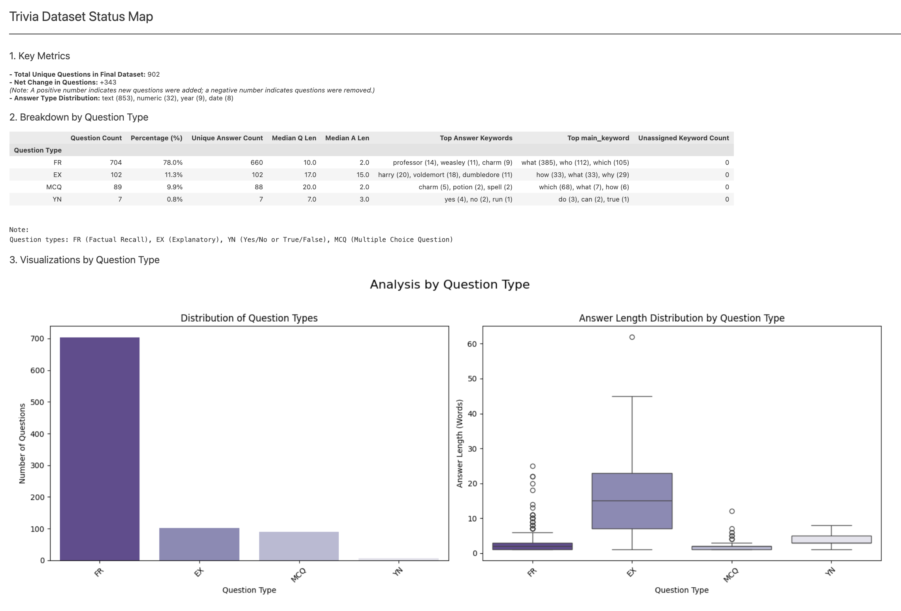
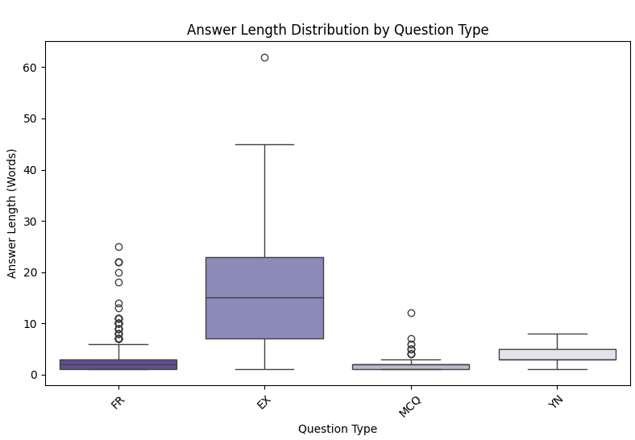

#  Semantic Verification Engine (SVE)
#### Constrained AI architecture for accurate, low-latency semantic evaluation  

## What is the SVE?

Many interactive knowledge systems require intelligent behavior but their economics cannot justify continuous dependence on Large Language Models (LLMs). The challenge is to stay accurate and responsive while keeping cost and latency predictable.
 

⛯ *Use cases: knowledge retention and interactive learning tools (e.g. educational games, certification practice, employee training)*.

These constraints led to a top-down architectural design defined by a **core concept**:

>*Move the expensive LLM work offline and compile it into validated, reusable assets. The runtime only serves those assets so it can stay lean, fast, and predictable*
---
► [✨**Live Demo**✨](https://34.27.245.64.sslip.io/) &nbsp;|&nbsp; [Tracer Implementation Walkthrough](notebooks/01_demos/01_tracer/README.md) &nbsp;|&nbsp; [Design Doc & ADRs](docs/00_DESIGN_DOC_AND_ARCHITECTURE.md) &nbsp;|&nbsp; [Execution Plan](docs/01_EXECUTION_PLAN.md) &nbsp;  ⚠️ *Note:  the MVP demo can take ~30s to load transformer models at the start - appreciate your patience* 😄

---

## Runtime Constraints (Tracer MVP)

The runtime environment has the tightest constraints that drive system design. The [Basis for Design (BoD)](docs/00_DESIGN_DOC_AND_ARCHITECTURE.md#15-basis-for-design) formalizes these constraints into boundaries the system must operate within and targets it should meet.

A tracer (minimum end-to-end build that exercises each subsystem) confrimed the logic and architecture work before automation is added.

The Tracer CLI-MVP column reflects what actually emerged from meeting those requirements in practice: some constraints were anticipated, others surfaced through deployment.

The constraints are iteratively refined as the telemetry from the tracer is collected.

| Constraint |BoD Requirement |Tracer CLI-MVP |
|-|-|-|
| Economics | Minimum-cost operation and minimize per-query API cost at runtime (near-zero)|GCP e2-micro (free-tier); zero runtime API cost.  Public demo HTTPS ~$11/month; security infrastructure cost emerged at deployment, within $20 contingency threshold |
| Performance|Local inference < 500ms p95;  LLM escalation < 1–2s p95;  gameplay feels smooth |CPU-only Docker runtime on e2-micro (2 vCPUs, 1 GB RAM, 30GB storage); local inference prioritised to minimise LLM dependency; ongoing collection of runtime latency|
| Quality |No hallucinations at runtime;  evaluators correctly distinguishes correct from incorrect answers| Zero generation at runtime; pre-validated Parquet assets.  Evaluator accuracy ≥ 85% (85–93% observed in notebook testing; runtime measurement pending) |
| Capacity |5–10 concurrent users within free-tier cost limits | GoTTY + Docker on GCP e2-micro; single-session in practice; GoTTY shares one terminal rather than managing independent sessions; 5–10 concurrent user target requires the planned FastAPI service layer|
| Scalability|Unit cost constant or decreasing as content volume grows | Offline intelligence layer; minimal AI cost per query;   planned FastAPI service + containerised deployment enables horizontal scaling with load balancing; ceiling determined by SBERT CPU compute ceiling, VM cost beyond free tier, and LLM API rate limits |

## The System Design

> **Project Status**: **Phase 2 tracer build completed and runtime MVP deployed.** End to ends system validated across all three subsystems. Runtime performance and generation quality metrics are being actively collected.

The full system design consists of three subsystems:

1. **Content Factory (offline)**: ingests raw source text and produces structured, validated trivia content through
Prefect-orchestrated pipelines. An adapted medallion-tier architecture enforces progressive quality gates before any content is passed on. 
   - Tracer status: end-to-end logic confirmed in notebooks; Prefect automation in progress.
2. **Context Refinery (offline)**: semantic processing and feature engineering layer that enriches the dataset with descriptive, contextual, and thematic features. 
    - Tracer status: descriptive feature logic confirmed; NER and other contextual features deferred to next stage.
3. **Runtime environment (online)**: A self-contained Docker container serving the game from validated, immutable Parquet assets. Evaluation is layered: exact match → structured rules → SBERT semantic similarity → LLM escalation. The container has no runtime dependency on upstream systems.
    - Tracer status: deployed and live.

**Figure 1**: The main deployment specification. This schematic represents the backbone of the SVE project (click on figure for a closer view).

Refer to the [*Design Doc and ADRs*](/docs/00_DESIGN_DOC_AND_ARCHITECTURE.md) for further details on architecture.

#### Reference Implementation
The SVE architecture is domain-agnostic. 
The underlying system solves a generalizable problem: converting dense, static knowledge into accurate, interactive, and auditable delivery at low cost.

- *Validation layer:*  The Harry Potter interface serves as the reference implementation and test surface.  
- *Why?* The series was chosen because it is a bounded knowledge domain, widely recognized, with well-defined scope that can be used to define objective validation criteria. It retains many of the language evaluation challenges from larger domains while remaining accessible and fun! 🧙🏼‍♂️. This makes it suitable for validating architecture without domain complexity obscuring the system behaviour. 
- *Generalization*: Applying SVE to a regulated domain, such as clinical Q&A, compliance training, or financial certification, would require stricter controls at specific layers. The requirements can be accommodated without structural redesign through configuration, enhanced validation, and policy controls.

## Preliminary Runtime Metrics
>⚠️ First-pass results: single batch, 13 sessions. Tracer dataset was intentionally composed to stress system design (high Explanatory question share). Figures will shift as session diversity and batch count increase. Do not treat as a stable baseline.

### Evaluation tier routing

|Resolution Tier| Questions | Share|Notes
|-|-|-|-|
|Exact match|30|26%|-|
|Fuzzy match|10|9%|-|
|SBERT semantic|40|35%|-|
|LLM escalation|35|30%|-|
|Unresolved|1|<1%| empty submission|

*Local inference resolution rate*: **69% of questions resolved without an LLM call**. This validates the use of the tiered evaluation, routing, and offline preprocessing.

### Latency
primarily determined by the LLM API call.
|Path|Average|P95|Notes|
|-|-|-|-|
|Local inference with SBERT|0.062s|0.15s (150ms)|Meets local p95 < 500ms target|Fast path; min observed: 0ms|
|LLM escalation|2.6s|7.1s|Above target; high EX question share inflates this, max: 33s|
|Overall evaluation|2.6s|9.9s|LLM path driven; p95 above 5s UX fallback. LLM evaluations include a 6s cooldown to manage RPM limits| 

- Free-tier penalty: shifting to paid-tier will shrink the required cooldown time needed between requests. Currently the free-tier requires 6s cool down, resulting in a evaluation latency of ~7s even if the LLM call itself took ~1 to ~2s.

### Compute
- primarily determined by SBERT local inference.
- Measured via `docker stats` over a single session (8min window) on a GCP e2-micro (0.25 vCPU baseline, 2 vCPU burst, 1GB RAM).
- SBERT operates as a burst workload, near-zero CPU at idle with short spikes during inference. No CPU throttling observed at current volume.

| Metric | Value |
|---|---|
| Idle CPU | 0.61% |
| Inference CPU (mean) | 54.41% |
| Inference CPU (max) | 83.55% |
| Memory (idle) | ~367 MB |
| Memory (loaded) | ~447 MB |

### Bottlenecks Identified
- Loading models in startup leads to 30s lag before gameplay begins that cannot be handled even even when the initialization sequence is broken up with SBERT loading and warmup handled after introduction with a UX loading screen. Will be handled when shifting to Fast API - will have a singular startup with container and keep it warm to avoid coldstart with every game start.
- Could not run on 10GB, docker build failed, not enough temporary cache for installation requirements. Increased VM storage to 30 GB.
- LLM latency is highly variable. Generally within the required range but can jump to ~22 to ~35 seconds. Mitigations include shifting to paid-tier (less cool down to manage RPM usage limits) and can be managed with self-hosting a model as a service when scale justifies.
- Explanatory answers contain  multiple implicit claims that SBERT similarity alone cannot reliably verify, routing them to the LLM judge by default. Primary driver of the 30% LLM routing share. Planned improvement: decompose long answers into atomic claims verifiable locally via SBERT / NLI, reducing LLM fallback and improving the shift-left resolution rate. NLI is implemented in evaluator but will come online with claims breakdown. 

## Offline Data Generation & Validation Results (Tracer)

#### Generation pipeline

- A total of 50 questions were generated from 6 chapters.
- Repeated runs over chapters for different question types generated: Factual Recall (FR) x 30 / Multiple choice (MCQ) x 30 / Explanatory (EX) x 30 questions.
- Pipeline consists of one generation pass, two enrichment passes to augment core fields for in-game intelligence (hint, explanation, answer variations, semantic entity references, and core lore concepts).

#### QA and Validation pipeline

- *Yield:*  **35 out of 50 questions (70%)** were promoted to Silver tier.  
- This pipeline also generates embeddings for core evaluation fields for questions that pass validation.
- The table below shows the breakdown by pipeline stage:

| Validation Check | Passed | Failed / Dropped |
|---|---|---|
| Structural validation against Silver schema (Pydantic) | 50 | 0 |
| Intra-batch semantic deduplication (across question types) | 44 | 6 |
| Contextual integrity (RAG-Triad): consistency check between source quote, question, answer | 42 | 2 |
| Alignment of answer variations to core fields (question, answer) | 38 | 4 |
| Alignment of MCQ options and LLM categorization to core fields| 36 | 2 |
| Canonical semantic deduplication (of batch against main Silver dataset)|35|1|

## How to review this Repository
The repo is structured for progressive discovery. Start with the README and demo, then go deeper based on what you want to explore.

1. **README** (this page): overview of architecture, constraints, validation results
2. **[Live Demo](https://34.27.245.64.sslip.io/)**: the deployed system running on a free-tier VM
3. **[Tracer Walkthrough Notebooks](/notebooks/01_demos/01_tracer/README.md)**: four notebooks that start at the runtime backend (anchored to the demo you just played). From there they step back to the beginning of the offline system and follows the generation and processing of a single synthetic question batch forward to the runtime handoff:
    - Runtime → Generation → Validation → Context Enrichment with Runtime handoff
4. **[Design Doc & ADRs](docs/00_DESIGN_DOC_AND_ARCHITECTURE.md)**: full 
   architecture specification, trade-off rationale, and decision records
5. **[Research Notebooks](/notebooks/02_research/)**: EDA, semantic deduplication, 
   SBERT analysis, prompt engineering experiments *(DS / NLP path)*
6. **[Pipeline Scripts](/scripts/pipelines/generate_questions/) + [Game Source](/src)** 
   — Prefect orchestration structure (*work in progress*), MVC (Model-View-Controller) architecture, evaluator router *(ML / AI systems path)*.

## A note on the design approach

I come from process engineering, where the discipline is to design 
against real constraints, validate before scaling, and measure what 
actually happens. This project applies that instinct to ML systems: 
enough upfront design to build confidently, enough pragmatism to ship something real and learn from it. The result is iterative development with design rigour.

<!-- 
NARRATIVE TO INTEGRATE (origin / discovery-design loop):

This started as a trivia game. Each limitation in the discovery phase pulled me 
to the next problem — brittle exact matching → semantic matching → dataset quality 
→ deduplication → manual curation didn't scale → synthetic generation → generation 
needed guardrails → validation. But it wasn't purely reactive: at each step I'd 
zoom out, see how the pieces fit the larger problem space, and apply top-down design 
(from my engineering training) to plan the response before implementing. 

The architecture emerged from that LOOP — bottom-up discovery surfacing what needed 
solving, top-down design shaping how it got solved, the next limitation validating 
or correcting the design. This is the FEL-meets-Agile tension the project set out 
to explore (design doc 1.2): upfront design discipline and iterative discovery 
working together, not competing.

Along the way: developed a concrete feel for what this tech costs to build and run 
(cloud, API, infra, free-tier limits) — intuition that's hard to get without paying 
real deployment bills.

KEY POINTS:
- BOTH modes: discovery (bottom-up) + structured design (top-down), in a loop
- not "emerged from chaos" (undersells design) nor "planned upfront" (untrue)
- the loop IS the FEL/Agile thesis the project explores — tie to 1.2
- depth earned through the loop, not imposed → dissolves "over-engineered"
- cost intuition as a named takeaway

- CLOSING LINE ALREADY WRITTEN: "The result is iterative development with design 
  rigour." — the narrative above should BUILD TO this line. It's the loop compressed: 
  iterative = bottom-up discovery, design rigour = top-down discipline, "with" = the 
  loop joining them. Integrate narrative so the line reads as earned conclusion.
-->

## Project Status
This project follows an architecture-first, iterative development lifecycle outlined in the [Design Doc](/docs/00_DESIGN_DOC_AND_ARCHITECTURE.md).

✅ **Phase 1: Data science discovery and game foundation** [COMPLETE]
- Discover and explore problem space and surface failure modes.
- Activities: EDA, baseline dataset construction, schema definition, MVC game architecture, and MVP deployment
with exact-match evaluation.

<i>Click to expand Phase 1 data science & MVP metrics</i>

### Phase 1 focused on discovery & prototyping
The raw dataset was manually curated and standardized to build the Baseline (v0) dataset. This manual process exposed the scalability bottlenecks that directly informed the [Content Factory architecture](docs/00_DESIGN_DOC_AND_ARCHITECTURE.md#p2-content-factory-architecture-in-depth) for Phase 2.

|Metric|Value|Description|
|-|-|-|
|Data Optimization|1279 → 902|Aggressive pruning (Q-Q cosine similarity) + Strategic Enrichment (100+ new explanatory items, 240+ rehabilitated)|
|Topic Diversity|86% unique|Answer-Answer (A-A) analysis confirmed high semantic variety, limiting repetition to core entities.|
|Taxonomy (interrogative identifier)|100%|Achieved complete categorization coverage using a custom tokenizer & lemmatization script. This is important because it is used to classify questions into the main types (Explanatory, Factual-Recall, Mulitple-Choice, Yes/No)|
|Class Balance|Baseline_v0 dataset|78% Factual Recall, 11% Explanatory, 10% MCQ, 1% Yes/No.|
|Schema Validation|	Pass	|Ingestion script with standardized schema checks, automated deduplications minimized error when appending to the main dataset|
|Game Core|	MVP	|Python MVC (Model-View-Controller) Architecture w/ pytest coverage|

#### Key Analytical Insights
* **Linguistic fingerprint:** Answer length can be used to distinguish between Explanatory (EX) from other short-answer types (FR, MCQ, YN). The [boxplot analysis (item 3 below)](#phase-1-visual-artifacts) shows the the interquartile range for EX answers (8-22 words) does not overlap with FR, MCQ, or YN.
    * *Architectural Implication:* Phase 2 monitors answer-shape patterns as the dataset grows to preserve consistency across question types. See [ADR-P2-014](docs/adrs/ADR-P2-014.md) for the full rationale and monitoring approach.
- **Vector drift**: The TF-IDF vectorizer struggled with the vocabulary shift introduced by new *explanatory* (EX) questions, directly motivating the switch to Sentence-BERT (SBERT) for Phase 2 deduplication.
- **Question-type imbalance**: The baseline dataset was heavily skewed toward Factual Recall (78%). This imbalance drove the requirement for the Phase 2 *Content Factory* to synthetically generate complex "Why/How" questions. These type of questions are key differtiators for the game experience. It should also be able to generate the other question types to keep dataset in balance.

#### Phase-1 Visual Artifacts

1. Interrogative keyword distribution (100% coverage) 
    

    
<i>🔎 View the keyword distribution plot</i>

    
    *(Click image to open full resolution)*
    

     

2. Baseline v.0 dataset status map 
    

    
<i>🔎 View Baseline v0 Status Map</i>

    
    *(Click image to open full resolution)*
    

     

3. *Box plot of Answer Length vs. Question type (Baseline v.0 dataset)*
    

    
<i>🔎 View the keyword distribution plot</i>

    
    *(Click image to open full resolution)*
    

 

🚧 **Phase 2: End-to-end core system validation** [TRACER COMPLETE]
- **On-going**: metrics gathering;  
- **Next:** stabilizing based on tracer findings, layering automation on confirmed logic, and updating the design to reflect what the tracer lessons learnt.

<i>Expand to view status of milestones</i>

|Milestone|Status|
|-|-|
|Prompt engineering and generation quality validation|✅ Complete|
|Tracer dataset (104 Legacy + 50 Synthetic across FR, EX, MCQ)|✅ Complete|
|End-to-end tracer logic validation (notebooks: generation → validation → enrichment → runtime)|✅ Complete|
|Runtime container deployment (GCP VM, Docker, Tailscale)|✅ Complete|
|Runtime performance metrics collection|🚧 In progress|
|Prefect pipeline automation — generation|🚧 In progress|
|Prefect pipeline automation — validation|📋 Planned|
|FastAPI service layer|📋 Planned|

Refer to [engineering backlog](/docs/03_engineering_backlog.md) for further details. 

## Tech Stack

Expand to view details

|Layer|Technologies|
|-|-|
|Language & Runtime|Python 3.12, Parquet|
|AI & Semantics| Google Gemini 2.5 Flash, Sentence-BERT (SBERT), NLTK|
|Validation|Pydantic V2|
|MLOps & Orchestration| Prefect, DVC, Docker|
|Infrastructure|Google Cloud VM, Google Cloud Storage, Tailscale, GoTTY|
|Testing|pytest|

See [requirements.txt](requirements.txt) for packages required to run the game, and [requirements-dev.txt](requirements-dev.txt) for the complete list of tools used in the game as well as notebooks, data processing, and advanced NLP work.

 

## Data Sources & License

See [Data_Sources.md](DATA_SOURCES.md) for all dataset provenance and usage documentation.  
This project's code is licensed under the [MIT License](LICENSE-MIT).

Data usage note

- *Raw Inputs*: The original raw trivia data used for Phase 1 baseline testing is documented in [Data_Sources.md](DATA_SOURCES.md) and is not redistributed in this repository.
- *Gold Dataset*: The runtime database is a hybrid asset. It consists of the original source data (cleaned, normalized, and validated) augmented with synthetic content and metadata generated via the Content Factory. To respect original copyrights, the full gold dataset is not included in this repository.

 

---
*Disclaimer: this project is an unofficial educational fan tribute to the Harry Potter series. Not affiliated with or endorsed by J.K. Rowling, Warner Bros., or any related parties.*
