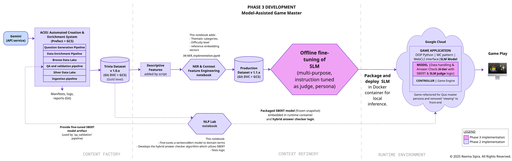
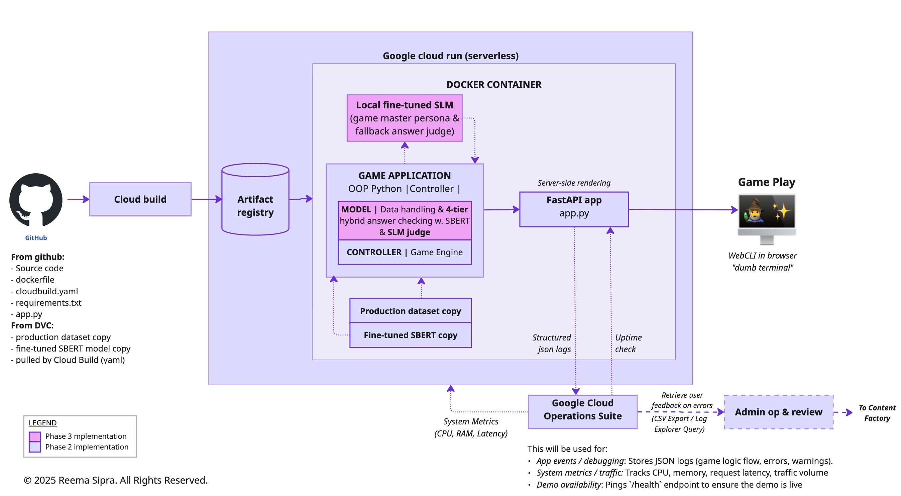

# Design Doc & Architectural Decision Records 

**Project: Semantic Verification Engine (Intelligent Trivia Platform)** 
**Author: Reema Sipra** 
**Status: Living Document** (design frozen per Phase) 

---

This document outlines the architectural evolution of the Semantic Verification Engine (SVE). It provides:
1. [**Project Plan**](#1-project-plan): defines [goals](#11-project-goals), [problem space](#12-problem-space), [design philosophy](#13-design-philosophy-applied-systems-thinking), and [basis for design](#14-basis-for-design).
2. **Architectural Schemes & ADRS** Detailed diagrams and decision records (ADRs) for each engineering phase.
    - **[Phase 1: The MVP (Legacy)](#phase-1-discovery--foundation)**
     Rules-based logic, MVC patterned game, standalone container.
    - **[Phase 2: System + Semantic Intelligence](#phase-2-end-to-end-system--semantic-intelligence)**
     Automated question generation, contextual feature enrichment, and semantic answer checking using Sentence-BERT.
    - **[Phase 3: Model-Assisted Game Master](#phase-3-model-assisted-game-master)**
       Runtime upgrade with an edge-served small language model (SLM) to maintain host persona and tie-breaker when Sentence-BERT similarity scores are ambiguous.
3. [**System thinking analysis**](#3-system-thinking-analysis-case-study): A high-level, conceptual exercise to holistically and dynamically assess the architecture and its design implications as part of the project case study.
4. [**Architectural mapping**](#4-mapping-to-industry-equivalent-patterns) of the project design to industrial patterns to validate and inform decisions.
> **Note on Execution:** This document groups system evolution into logical engineering *Phases*, however the actual delivery would be executed as agile sprints to prioritize the product releases. For the current development roadmap refer to the **[Execution Plan](./01_EXECUTION_PLAN.md)**.

---
 

# 1: Project Plan

>Quick links: &nbsp;&nbsp;&nbsp;[[Project Goals](#11-project-goals)]&nbsp;&nbsp;&nbsp;[[Problem Space](#12-problem-space)]&nbsp;&nbsp;&nbsp;[[Design Philosophy](#13-design-philosophy-applied-systems-thinking)]&nbsp;&nbsp;&nbsp;[[Basis for Design](#14-basis-for-design)]

## 1.1: Project goals

1. **Product**: Build an intelligent, domain-centric trivia game demo that prioritizes correctness, low latency, and a smooth game experience. The focus is on a constrained knowledge base and efficient delivery, at free or very low cost.
2. **Personal development**: Deepen hands-on expertise in NLP, software architecture, and MLOps by designing and implementing an end-to-end AI system using professional deployment and operational standards.
3. **Cross-domain exploration:**: Apply chemical engineering practices (Front-End Loading, systems thinking) to software and AI design, exploring how rigorous upfront planning could complement fast, iterative execution.

    Software and ML move fast, with many ways to solve the same problem. The ADRs make design thinking explicit, clarify trade-offs, and document patterns, both to guide current implementation and serve as a reference for future projects.

    The architecture guides implementation, ensuring design decisions are validated against actual performance. 

## 1.2: Design Approach
This project intentionally applies rigorous system design to a constrained domain. It serves two parallel goals: validating the idea of speed through rigour and accelerating my own learning through practice. As a result the project combines several learning objectives into a single end-to-end system to see how they interact:

1. **Data Science (the core)**: exploratory data analysis (EDA), contextual feature engineering, semantic similarity evaluation, and select fit-for-purpose NLP techniques.
2. **System Design (the blueprint)**: Translating the data science insights into architectural constraints and viable trade-offs.
3. **MLOps & Agile (the execution)**: Evolving those constraints into a resilient system iteratively.

The goal is a system design with clearly defined boundaries, roles, and constraints and aligned with **[established architectural patterns 🏛️✨](#4-technical-architecture--pattern-mapping)**. This document focuses on architectural clarity rather than production deployment.

💡 **The Interdisciplinary Lens**.
This project explores questions that emerged during development:
- **Front-End Loading (FEL) & Agile**: FEL resembles the *Design Doc / RFC* phase (definition before execution to mitigate risks and costs).  So *where  does early design prevent rework and where does it introduces friction?*
- **Process design & System thinking** Both aim to define constraints early, reason about flows, and reduce downstream issues. *How do these approaches overlap or differ?*

**Context**:  Coming from a chemical engineering background, I have seen the value of rigorous upfront design in high-risk systems, but I am also aware of its limitations (rigidity, slow feedback). This project deliberately plays with that tension and explores how disciplined systems thinking can support fast, iterative delivery.

## 1.3: Problem space
Based on the lerarnings from the [discovery stage](#phase-1-discovery--foundation) (Phase 1), the key challenges are:

1. **Data scarcity**: The existing question pool is small with limited quality. Manual curation is time consuming, error prone, and inefficient. 
2. **Data saturation**: Limited source material (Harry Potter books) constrains variety.
3. **Closed-domain application**: Focused on a trivia / Q&A session orchestration, not open-ended chat.
4. **Sustainable economics**: Demo must be low-cost and maintainable. Viable paths to scale should be integrated to avoid runaway costs and keep operational expenses manageable.
5. **Correctness and accuracy** of the questions and answers are critical for player trust and game credibility.
6. **Game UX**: Smooth front-end experience for player engagement. 
7. **Replayability**: Adequate variety across sessions to maintain interest.  For long-term engagement, the experience should remain fresh even when the factual content (the dataset) remains static.

## 1.4: Design philosophy (applied systems thinking)

The design of the project is grounded from the start by looking at the project lifecycle as an interconnected whole. The core approach has four main aspects:

1. **Agile Front-End Loading (FEL)**: Combine upfront design with iterative sprints to balance planning and execution..
2. **Upstream optimization ("shifting left")**: Solve problems early to reduce downstream complexity. By solving problems earlier, we can trade higher initial effort for permanent gains in runtime speed, cost, efficiency, and reliability once the product is live.
3. **Systematic evolution**: As the project progresses, requirements will inevitably change. Components evolve systematically, with reusable, extensible, and feedback-driven design.
4. **Swiss cheese approach**: layered defensive strategy (prevention, detection, correction) for data quality assurance.

## 1.5: Basis for Design

Constraints and target boundaries:

||**Constraint**|**Requirement**|**Target**|**Safety margin /** **Contingency**|
|-|-|-|-|-|
|1|**Economics**|**Zero-cost operation**.The project demo must not incur any costs during development and be able to operate indefinitely without any operational costs|$0 fixed monthly cost|Apply hard budget alerts with a circuit-breaker set at $5.00/month|
|2|**Performance**|**Low-latency**. Gameplay interactions need to feel instantaneous to maintain user immersion|< 500ms latency (p90)|Apply UX fallbacks to remain within acceptable UX limit (< 5s).|
|3|**Quality**|**Domain authenticity**. Content must be tonally consistent and canonically accurate to satisfy fan base (tweens to adults)|100% Verifiable (books 1-7, movies, Rowling's supportive works)|Swiss cheese logic (multi-layered validation)|
|4|**Capacity**|**Demo scale**. System needs to be sized to handle expected concurrent users within cost (free) limits.|5 - 10 concurrent users|Graceful Degradation. Implement load shedding or request queuing rather than crashing or incurring unplanned costs.|
|5|**Scalability**|**Future-Proof economics**. Design should demonstrate viable path to scale where growth doesn't erode margins (capex vs. opex)|Constant or decreasing unit cost|Prototype & projection. Use "tracer bullet" experiments to empirically validate assumptions before committing to the architectural pattern|

### Objective
Build a smart, domain-centric trivia game demo that prioritizes correctness, low latency, and a smooth game experience with minimal cost.

---

# 2: Architectural Schemes & ADRs

The project has **three** design stages. T

Phase|Link|Function| Risk Mitigated|ADR Summary|
|-|-|-|-|-|
|1|[Discovery & Foundation](#phase-1-discovery--foundation)|**Logic core & Baseline.** Establishes the MVP game state logic and a manually curated dataset, serving as the functional blueprint for subsequent automation. Kiosk-style, cloud-based containerized demo| **Viability & Quality Risk**. Validates game mechanics and identifies critical data gaps (skew, bias, completeness) in the manual baseline.| [P1 Key Decisions](#p1-key-decisions)|
|2|[End-to-End System + Semantic intelligence](#phase-2-semantic-intelligence)|**Design Backbone with Semantic Upgrade.** Critical path for synthetic generation, contextual enrichment, and semantic answer checking, with runtime upgrades (logging, automated GitHub interactions).|**Quality, logic, and economic risk.** Mitigates dataset limitations identified in Phase 1, resolves exact-match brittleness, and validates the zero-cost hypothesis under Free Tier constraints.| [P2 Key Decisions](#p2-key-decisions-adrs)|
|3|[Model Assisted Game Master](#phase-3-model-assisted-game-master)|**Edge architecture.** Produces the final containerized artifact combining embedded dataset with a local SLM for persona consistency and answer adjudication.|**Feasibility & Performance Risk**. Confirms the architecture fits memory/CPU constraints defined in the [Basis for Design](#basis-for-design). Validates acceptable SLM latency (<5s), and establishes concurrency limits.  **Design contingency**: *If local SLM inference fails to meet constraints, the architecture pivots to limited LLM API calls for reactive persona responses, mediated by an interaction manager.*|[P3 Key Decisions](#p3-key-decisions-adrs)|

 

📝 **Note on execution strategy**:  
The architecture is presented linearly. However, early tracer-bullet experiments are used to validate runtime cost, latency, and viability upfront. For execution details, see the [execution plan](01_execution_plan).

 

---
# PHASE 1: Discovery & Foundation 
**Objective**: Develop core components of game, identify pain points.

## P1 Overall Development Scheme

**Figure 1.** High-level development scheme showing the components involved in developing the baseline dataset and integrating it with the game engine.

The EDA module (`cleaning & EDA notebook`) is responsible for validating the raw dataset and profiling its structure, quality, and source-content coverage. Insights produced at this stage inform downstream processing.

Data then flows into the processing module (`processing & feature engineering notebook`). This component provides the core transformation layer of the scheme. Its responsibilities include:
1.  Remove incomplete, incorrect, and out-of-scope questions by manual review and executing automated semantic-deduplication logic.
2. Establishing and enforcing the standardized schema required for the baseline dataset.
3. Integrating curated, high-quality replacement questions through an automated ingestion script, with changes to the dataset monitored using a status dashboard for monitoring

The output of this processing layer is the `Baseline Trivia Dataset v0`, exported as a local CSV artifact. This serves as the data layer for the MVC-based CLI game application, which consumes the dataset for question delivery and gameplay logic.

## P1 Key Decisions

|**ADR ID**|**Title**|**Status**|**Summary**|
|-|-|-|-|
|[ADR-P1-001](adrs/ADR-P1-001.md)| Game design (SOC & MVC pattern)|✅ Accepted (retroactive)|Separates Logic/Data/View to enable future web porting|
|[ADR-P1-002](adrs/ADR-P1-002.md)|Dataset storage (CSV vs Parquet)|✅ Accepted (retroactive)|Maintain data types when porting between notebooks (and pipelines in future)|
|[ADR-P1-003](adrs/ADR-P1-003.md)| Data ingestion control flow (Status/Payload Pattern)|✅ Accepted (retroactive)|Allows the user to handle partial success states (e.g. semantic duplicates) when ingesting new questions|
|[ADR-P1-004](adrs/ADR-P1-004.md) | Stateful VM deployment strategy | ✅ Accepted | Deploy the trivia game as a  web-terminal on a VM for a rapid launch with minimal refactoring.|

*Refer to the linked Architectural Decision Records (ADRs) in the table for full details*.

## P1 Game Internal Architecture (CLI-MVP)

The trivia game is built in Python using a Model-View-Controller (MVC) setup. The pattern allows for modularity, where the `View` interface can be decoupled from the core logic for an eventual transition to a web UI. The `rich` library was used to elevate the terminal experience as clean and fun. 

**Core Objectives of the MVP**
- *Validate game logic*: Ensure the end-to-end flow, from loading questions to scoring and completion, is stable and error-free.
- *Identify answer-matching limitations*: Use this phase to document where exact text-matching fails and confirm whether semantic-answer checking is justified.

 

 
**Figure 2.** CLI-MVP Game architecture with Class interactions. *Click on figure for an expanded view.*

## P1 Runtime Environment (CLI-MVP)

**Design**: Embedded read-only architecture  

The dataset is baked directly into the container as a static file. This keeps the implementation simple and robust and meets the design constraints:
- **Zero gametime latency**: The game samples ~10 ~20 questions immediately from local memory at startup.
- **Operational simplicity**: The container is self-contained. Since the dataset is small (~1K records) and the source domain is finite, updates are infrequent. This eliminates the need for any complex database connections or constant read operations.
- **Separation of concerns**: Heavy data operations are handled offline. The runtime environment is strictly read-only, optimized for speed and portability.

 

 
 
**Figure 3.** Phase 1 CLI-MVP demo deployed as a container on a Google Cloud Platform (GCP) Virtual Machine. *Click on figure for an expanded view.*

### Implementation and deployment strategy

The goal for Phase 1 is a *frictionless player experience*. This requires a secure, continuously available demo deployed with minimum refactoring and minimum cost. This required iterating two aspects:

#### 1. User Experience (UX)
The original CLI-MVP (v0) came across as a *wall of text* which hindered immersion in the game. So minimum refactoring (v.0.1) was done to the View and Controller classes to provide focused, incremental views (e.g. displaying one question at a time) to better suit a web-terminal interface.

#### 2. Runtime system design and security

- *Immediate deployment*:  Since the CLI-MVP game is working, a cloud-hosted Virtual Machine (VM) wrapped as a web terminal (using Gotty) would allow the game to run within the browser without refactoring (*figure 3*).
- *User trust*: the http "not secure" warnings before the game start would make Players hesitate to try the game. To mititgate, a short-term $4/month fee was acceptable for a static IP address for the VM or Let’s Encrypt (via Caddy) could verify our domain and issue certificates and enable https. Since phase 1 demo is short-term until the phase 2 demo comes online, the cost is acceptable.
- *Availability*: Using the `e2-micro` instance on Google cloud made the game persistently available within the free-tier. Note: running is cheaper than turning it off, since Google charges for unused static IPs.
- *Layered defenses*: There are three layers to handle different risks of deploying to the internet:
    1. GCP Firewall: The first line of defense to filter out bots and noise.
    2. UFW (VM Firewall) & Caddy: Encrypted traffic is managed by Caddy, and UFW limits VM access to only essential services (HTTPS, SSH).
    3. Docker Sandboxing: The containerized game engine is isolated from the host OS, ensuring the application has no access to cloud system configuration. This also streamlines with the phase 2 serverless design.
- *Admin Access*: Management is handled via a secure SSH connection through a Tailscale tunnel, featuring real-time, bi-directional workspace sync for rapid updates.
- *AI orchestration*: Gemini was used as a technical collaborator to iteratively develop, refine, and troubleshoot syntax-heavy infrastructure components, including Dockerfiles, Caddyfiles, and UFW configurations.
- Refer to [ADR-P1-004](adrs/ADR-P1-004.md) and [P1 runtime architecture doc](archive/phase1_legacy/02-P1_runtime_architecture.md) for further details.

## P1 Design Limitations

1. **Manual dataset modification**: Dataset quality relies on manual, iterative review and cleaning. This process is slow, inconsistent, and prone to errors.
2. **Slow question generation**: Question creation is time-consuming and does not scale efficiently.
3. **Insufficient dataset quality and coverage**: The cleaned baseline dataset is still limited in size and depth. It is not sufficient for SBERT training, lacks strong focus on core lore and books, shows imbalance in question types, and produces mostly straightforward questions. This leaves significant room to improve the experience for knowledgeable fans.
4. **Rigid answer checking**: Answer validation relies on direct string matching making it fragile and leading to a poor user experience.
5. **Rule-based feedback only**: Feedback is deterministic and rule-based which can sometimes fail to reflect in-game context or partial correctness.
6. **User Experience**: The CLI MVP focuses on validating gameplay flow and answer evaluation but Players may not find it engaging.
7. **Limited runtime scalability**: this is constrained by the lightweight VM resources. It can accommodate light multi-user access but it hasn't been tested for sustained concurrent use.

 

# PHASE 2: End-to-End System + Semantic Intelligence 

**Objective**: Critical path development, horizontal slicing. Automate content generation and deploy a cloud-native MVP.

## P2 Overall development

This marks a major shift in the project. Phase 2 intentionally concentrates architectural complexity offline so that runtime and gameplay remain simple, fast, and deterministic. It moves from data science experimentation to MLOps infrastructure development and lays the architectural groundwork.

The key value-add here is the introduction of *semantic intelligence* at the interaction level. Players are no longer required to match exact wording when answering questions; the game can recognize differently phrased but equivalent answers, making interaction feel more natural and less rigid. This does not involve live GenAI reasoning or control at runtime.

The figure below shows the overall architecture. The dark purple components (baseline trivia dataset v0 and the game application code) are inherited from phase 1. 

**Figure 4.** High-level phase 2 system architecture.

The system is split into three main regions. The first is the *Content factory* is responsible for the data generation and maintenance following a *Medallion pattern*, creates a gold-level dataset. Refer to the [Content Factory in-depth](#p2-content-factory-architecture-in-depth)  section for further details  

The dataset then passes to the second **Context Refinery** subsystem. Here the data is processed for contextual enrichment (e.g NER tags, difficulty labels). The feature logic is developed and validated interactively using notebooks. The new features are added to the `Production` dataset offline keeping the runtime interface stable. 
The game will have a tiered, hybrid answer-checking approach to balance speed, determinism, and robustness:
1. Exact match
2. Fuzzy match
3. Semantic similarity (Sentence-BERT)
The SBERT model's primary purpose is semantic answer checking at runtime but it also enables offline capabilities. Using a *single-producer, multi-consumer pattern* → the model is generated once and consumed by multiple independent components: the Content Factory (for validation), the runtime (for answer checking), and the production dataset (as reference embeddings).

The design of Context Refinery mirrors the industry Feature Store pattern  where all the feature addition is decoupled from other subsystems to create an offline store (refer to [section 4](#4-technical-architecture--pattern-mapping)). 

<strong>Expand for design note: How Context Refinery was refined using the Feature Store pattern</strong>

### How the Feature Store lens refined the Context Refinery

The Context Refinery was already designed as a decoupled system for adding *contextual information* to questions. Its original role was narrow by intent, to enrich questions with additional context without affecting the runtime path. When this design was later compared against Feature Store pattern it became clear that the Context Refinery was already doing part of the job but could reasonably own all the feature engineering.

This comparison led to a few concrete refinements:
- **Feature engineering is fully centralized in the Context Refinery**: Descriptive features were moved out of the `qa_validation` pipeline in the Content Factory.
- **Semantic feature usage is simplified and unified**: SBERT usage was centralized. Instead of re-running the model in multiple places, a shared embedding index derived from the Gold dataset is reused for semantic checks and deduplication.
- **Notebooks are treated explicitly as prototypes**: Feature notebooks are written with the assumption that they are temporary; a place to explore and validate logic before it is hardened into an automated pipeline later.

This shift did not change the system’s behavior, but it clarified responsibilities and reduced duplication. It also directly informed the next Phase design for the Context Refinery 

**Future iteration (conceptual): more automated feature workflow**

A natural next step is to automate parts of this workflow so new features can be added without relying on notebooks. In its simplest form, this would not require a full Feature Store service. A lightweight interaction layer (e.g. script with structured inputs) would be enough to trigger feature generation using the same validated logic already in place. This would make feature addition faster and more consistent, while keeping the system lean and aligned with the existing design.

 

Finally the dataset is ready for *production* (in-game use). It is also used to fine-tune a SentenceBERT model. This is then deployed back into the system to the `qa_validation` pipeline, as well as to add reference embedding vectors to the production dataset to provide static basis for in-game answer checking, and to the game itself for processing the player answer.

### Phase 2 Architectural Invariants
This section captures the core assumptions the system relies on to remain correct and predictable. These invariants define ownership, data flow direction, and consistency rules that shape the SVE system behavior. Making them explicit helps guide future changes and prevents accidental violations as the system evolves

| Invariant | Description | Enforced by |
|---------|------------|------------|
| **Single semantic source of truth** | The Gold dataset is the authoritative source for semantic data. Semantic embeddings are generated in the `qa_validation` pipeline and owned by the Gold dataset. Semantic comparison rules are defined in [ADR-P2-013](#p2-key-decisions-adrs). | Content Factory pipelines |
| **Single active SBERT model** | At any point in time, exactly one SBERT model version is active across offline pipelines and runtime. Model versioning and upgrade rules are defined in [ADR-P2-013](#p2-key-decisions-adrs). | NLP Lab + pipeline validation |
|**Embedding-Schema coherence**|Every Gold record must contain a Question and Answer embedding generated by the currently active SBERT model, see [ADR-P2-013](#p2-key-decisions-adrs)|Pydantic `Silver` schema|
| **Gold dataset immutability** | Gold datasets are treated as immutable artifacts. All updates produce a new version rather than mutating data in place. | DVC + publishing pipeline |
| **Stateless runtime** | The runtime does not generate or mutate data. It only consumes production-ready artifacts. | Runtime architecture |
| **Offline-first intelligence** | Expensive or high-volume intelligence is performed offline. Runtime logic is optimized for latency and responsiveness. | Phase 2 design |
| **Gold → Production only** | Data flows unidirectionally from Gold to Production. Production datasets are regenerated artifacts and are not used as inputs to Content Factory pipelines. | Publishing pipeline |

**Design note**: Evaluating DVC surfaced an open boundary decision around how much generation metadata to retain for traceability versus shed for a lean runtime dataset. This boundary will be validated after observing real generation → validation → enrichment pipeline runs.

### P2 Data lifecycle

|**Data Tier**|**State**|**Purpose**|**Key data added**|
|-|-|-|-|
|*Bronze*|*Raw*|Ingestion & Schema Check|`question_source`, `data_tier`|
|*Silver* | system of record (invariant + traceable ledger) | truth layer for all validation + audit + lineage | cleaned strings, validated MCQ logic, deduplication flags, grounding checks, **`master_id`**, SBERT embeddings, model versions, full trace metadata |
| *Gold* | *derived runtime contract (pruned projection of Silver)*| lean runtime mirror for game + Context Refinery handoff | minimal game-ready fields (metadata stripped) |
|*Production_Green*|*full, feature-rich*|Full-schema production dataset including dev and experimentation feature|NER tags, Contextual Features, Descriptive Features|
|*Production_Blue*|*lean, feature-rich*|Stable, lean runtime ready dataset with only columns necessary for game handoff|Optimized subset of NER/Contextual features required for runtime.|

**Architecture Notes**: 
The data-tiers are managed and gatekept using Pydantic v2 models with sequential inheritance from 
BaseModel -> [Bronze_Legacy | Bronze_Synthetic] (parallel ingestion) -> Silver (system of record / invariant ledger) → Gold (derived runtime contract) → Production layers (feature views): {Production_Green | Production_Blue} (branching inheritance).

**1.The Silver-Gold Separation of Concerns**
To ensure low-latency handoffs to downstream systems while maintaining clear traceability of LLM-generated content, a strict separation of concerns will be enforced between the Silver and Gold tiers:
- *Silver (audit ledger)*: An append-only historical log. It retains every LLM evaluation trace, pipeline margin score, and model version. If a generated question exhibits a flaw in production, it will be queried in the Silver ledger to trace the exact prompt, grounding source quote, and validation logic that allowed it to pass.
- *Gold (runtime contract)*: A derived, stripped projection of the Silver system-of-record. It contains only the fields required for runtime execution and downstream contextual enrichment.All heavy pipeline metadata and trace logs are stripped out. It contains only the strictly-typed, normalized data required to serve the game, ensuring the downstream Context Refinery is not bloated by upstream engineering logs.

**2. Production Green (development) & Blue (stable) Separation of concerns**
These datasets handle the handoff between the *Context Refinery* and the *Runtime Game* subsystems.
- *Production_Green* dataset:  This is used for feature discovery and MLOps telemetry. It contains the full suite of features (e.g. token counts, keyword tokens, NLP metadata). This dataset is for experimentation, as well as assessment and fine-tuning of the answer checking evaluators and semantic thresholds, error analysis and debugging.
- *Production_Blue* dataset: lean runtime for optimized performance (mirror of *Green* where unnecessary gametime columns are shed). This allows for stable version for the Docker container with focus on game performance and answer evaluation.
The lifecycle will be managed as follows:
- *Schema decoupling*: Both systems inherit from the Gold dataset, ensuring a singular source of truth for core trivia while allowing the refinery to branch for different use cases (development vs. stable runtime).
- *Promotion workflow*: once a feature is vetted and finalized in the Green and is used in the game logic, it is promoted to the Blue schema.
- *Live, symmetric tensor generation*: Both mirrors utilize static embeddings that are hydrated into live PyTorch tensors during the session warmup ensuring high-speed matrix operations during the answer evaluation.
- *Central runtime router*: enables the game engine to toggle between Blue (stable mode) and Green (development / debug mode) without modifying the evaluation logic.

**3. Object-oriented evaluation contract for the Answer Evaluators**: The pydantic schema is the interface for the runtime Answer Evaluators. So instead of passing dataframe rows parsed as dicts, the game instantiates them into a `Question` object.
- *Allows for dot-notation*: This allows for the data to be accessed via strict predefined attributes based on the SOT Pydantic schema (eliminating KeyErrors or column mixups).
- *Schema driven logic*: The `answer_type` Enum defined in the schema acts as the primary key for the `runtime_router` dispatch logic, ensuring the right data payload always hits the correct Answer Evaluator.

## P2 Key Decisions (ADRs)

| ID | Title | Status | Summary |
| :--- | :--- | :--- | :--- |
| **I. Strategy (core ADRs)** | | | |
| **[ADR-P2-001](adrs/ADR-P2-001.md)** | **"Shift Left" Enrichment** | ✅ Accepted | Move expensive NLP operations (hints, fun facts) from Runtime (Phase 3) to the Pipeline (Phase 2) to ensure low-latency gameplay. |
| **[ADR-P2-002](adrs/ADR-P2-002.md)** | **Medallion Data Architecture** | ✅ Accepted | Organize data into Bronze (Raw), Silver (Validated), and Gold (Enriched) layers to ensure traceability and safe checkpoints. |
| **[ADR-P2-003](adrs/ADR-P2-003.md)** | **Context Refinery Pattern** | ✅ Accepted | Move descriptive feature generation out of the Content Factory. Context Refinery operates as an offline feature store. |
| **[ADR-P2-004](adrs/ADR-P2-004.md)** | **Generative Model (Gemini)** | ✅ Accepted | Standardize on **Google Gemini** for synthetic data generation due to superior cost-performance ratio and native integration with the GCP stack. |
|[ADR-P2-005](adrs/ADR-P2-005.md)|**Tiered semantic answer-checking strategy**|✅ Accepted (retroactive)|Use a tiered approach to balance latency and correctness: (1) direct match, (2) fuzzy match, (3) semantic similarity using Sentence-BERT|
| **[ADR-P2-013](adrs/ADR-P2-013.md)** | **Centralized Semantic Validation Strategy** | ✅ Accepted | Establishes the Gold dataset as the single source of truth for semantic embeddings and standardizes semantic validation using a single SBERT model across the system.|
|**[ADR-P2-017](adrs/ADR-P2-017.md)**| Serverless Deployment | ✅ Accepted | Move to a managed container service to enable automatic scaling, reduce operational maintenance, and support a multi-user FastAPI backend.|
 

<strong>👇 Expand to view supporting ADRs (implementation, tooling, experiments, and deferred decisions)</strong>

 

| ID | Title | Status | Summary |
| :--- | :--- | :--- | :--- |
| **II. Infrastructure** | | | |
| **[ADR-P2-006](adrs/ADR-P2-006.md)** | **API Framework (FastAPI)** | ✅ Accepted | Select FastAPI over Flask for native Pydantic integration, async performance, and automatic documentation. |
| **[ADR-P2-007](adrs/ADR-P2-007.md)** | **Client Architecture** | ✅ Accepted | Decouple the frontend as a "Remote Terminal" (or Web App) that communicates strictly via HTTP/JSON with the backend. |
| **[ADR-P2-008](adrs/ADR-P2-008.md)** | **Structured Logging (JSON)** | ✅ Accepted | Configure all application and pipeline logs to emit **Structured JSON** rather than raw text, enabling query-based observability in Cloud Logging. |
| **III. Pipeline Engineering** | | | |
| **[ADR-P2-009](adrs/ADR-P2-009.md)** | **Data Versioning (DVC)** | ✅ Accepted | Use **DVC (Data Version Control)** with GCS backend to version large datasets/models, ensuring strict reproducibility between Code and Data. |
| **[ADR-P2-010](adrs/ADR-P2-010.md)** | **Orchestration (Prefect)** | ✅ Accepted | Use Prefect DAGs to manage dependencies, retries, and observability, replacing manual script execution. |
| **[ADR-P2-011](adrs/ADR-P2-011.md)** | **Validation Layer (Pydantic)** | ✅ Accepted | Enforce strict schemas at the "Silver" layer entrance to reject malformed data before expensive enrichment. |
| **[ADR-P2-012](adrs/ADR-P2-012.md)** | **Dataset enrichment pipeline (Notebook → Script transition)** | 🚧 Proposed | **Bootstrap & Shed:** Use a notebook to bootstrap Gold with curated legacy data then shed it after transitioning to automated generation|
|**[ADR-P2-018](adrs/ADR-P2-018.md)**|Stateless Game Architecture for Cloud Deployment|🚧 Proposed|Refactored the MVP from a stateful CLI loop to a stateless request/response architecture, enabling serverless deployment while preserving the `rich` console rendering.|
| **IV. Algorithms & Heuristics** | | | |
| **[ADR-P2-014](adrs/ADR-P2-014.md)** | **Heuristic Stability (LLM Drift)** | ✅ Accepted | Preserves heuristic answer-shape patterns across question types through prompt-led generation and manual, dataset-level monitoring for drift.|
| **[ADR-P2-015](adrs/ADR-P2-015.md)**|**Statistical Quality Control (SQC) for Synthetic Data**|🚧 Proposed|Applies statistical sampling to synthetic data batches as an offline safety net to catch incorrect or hallucinated questions early, using efficient, conditional review to protect user trust at demo scale.|
| **V. Deferred / Superseded** | | | |
| **[ADR-P2-016](adrs/ADR-P2-016.md)** | **Manual Input Swimlane** | ⏳ Deferred | Defers a third manual input swimlane for low-volume, manually curated questions that introduce novelty and gameplay variety in the Content Factory.|
| **[ADR-P2-019](adrs/ADR-P2-019.md)**|**Exclusion of Yes/No (YN) Questions from Gold Dataset**| ✅ Accepted| lYN questions provide limited signal for semantic validation in Phase 2 |
<!--Next tag = 20 -->

---

## 3: System Thinking Analysis

*As a focused case study to explore how systems thinking can augment conceptual design, we explore the Phase 2 design holistically using a systems-thinking lens. The full analysis can be found in [/docs/02_system_thinking_casestudy.md](/docs/02_system_thinking_casestudy.md) and is summarized here.*

Systems thinking is used here as a qualitative, early-stage filter to reason about system behavior (stocks, flows, accumulation, feedback) and to surface key design implications. Its role is to direct focus and prevent premature optimization. A lightweight sensitivity analysis was then used to translate the key behavioral insights into actionable targets and design considerations.

The system was analyzed from two perspectives:
1. **Full system (level 0)**: considers the behaviour of the system against design constraints from generation to runtime handoff, at different **growth scales**. Specifically the shift from the *zero-cost* serverless runtime to paid scale production, and the resulting stress on the runtime environment.
2. **Content Factory (level 1)**: The offline content generation is the primary value driver for this project. While the production can scale with usage, the source content is limited (~7 books), raising questions around dataset saturation and long-term content quality as the system grows.

The system-thinking approach asks you walkthrough your design an understand how it would behave dynamically under different conditions. It helps surface key challenges, identify leverage points, and narrow attention toward dominant behaviors. Sensitivity analysis can then be used to translate these behaviors into actionable targets and design ideas. The main takeways the analysis revealed are:
1. Hallucination rate target ≈ 1% to maintain user trust and keep downstream correction mechanisms viable.
2. Session size ~ 15 questions to further limit user exposure to residual errors in gameplay.
3. User feedback is a weak correction signal at demo scale and should not be relied upon as the primary quality control mechanism; quality control should be shifted left through active offline QA.
4. Active QA strategies for demo (e.g. sequential acceptance sampling) after each question generation batch. 
5. User feedback signal for correction becomes reliable as a safety-net only at larger scales (~100+ game sessions per day). Provisions for incorporating user feedback should therefore be included in the Phase 2 design, considering a staged strategy that evolves from demo to full-scale operation.
 

---

## P2 Content Factory Architecture (in-depth)

**Purpose**: Phase 2 introduces the Content Factory to solve a structural problem uncovered in Phase 1 → a finite, error-prone dataset that must evolve continuously without manual rework or runtime cost.

**The architecture prioritizes offline correctness, traceability, and safe iteration that is a trade-off for pipeline system simplicity.**

**Figure 5.** Phase 2 Content Factory architecture (final iteration). 

The Gold dataset is initialized by passing the curated legacy questions through the same `qa_validation` pipeline used for synthetic question generation. This ensures that Gold is always materialized through the same single, validation path rather than being treated as a special case at the start.

Once Gold is established, all newly generated questions are validated and deduplicated against the existing Gold dataset. This ordering is intentional; it prevents curated legacy questions from being incorrectly flagged as duplicates of later synthetic content and guarantees that all semantic comparisons are performed using the same logic and thresholds.

Semantic embeddings are generated as part of dataset materialization. All embedding generation occurs within the `qa_validation` pipeline, making the Gold dataset the single semantic source of truth for deduplication and validation across the system.

The system initially uses a vanilla SBERT model for sentence similarity. Fine-tuning is deliberately deferred until contextual features, NER outputs, and generated question–answer variations are sufficiently mature to support meaningful training, avoiding premature optimization and rework.

### Design evolution

|**Iteration**| **Goal**|**Structural change**|**Limitation exposed**|**Artifact**| 
|-|-|-|-|-|
|**1**|Validate GenAI generation|Linear generation + validation with explicit Bronze → Silver → Gold data flow (Medallion structure)| No mechanism to integrate existing high-quality baseline data|[Diagram: Iteration 1](../assets/docs/phase2/p2_content_factory_iterations/p2_cf_iteration_1.jpg)|
|**2**|Integrate verified baseline data|Two ingestion paths into Bronze layer (synthetic + curated)|Gold dataset could not be safely extended without overwriting or ad-hoc patching|[Diagram: Iteration 2](../assets/docs/phase2/p2_content_factory_iterations/p2_cf_iteration_2.jpg)|
|**3**|Enable safe, repeatable dataset evolution|Replace ad-hoc update scripts with a unified enrichment pipeline supporting multiple execution modes (update, correction, feature addition)|Enrichment pipeline overhead not justified by the expected frequency of change / updates to trivia dataset|[Diagram: Iteration 3](../assets/docs/phase2/p2_content_factory_iterations/p2_cf_iteration_3.jpg)|
|**4**| Improve validation and correction controls|1. SBERT decoupled into index for deduplication  2. manual correction mechanism (Kill list + SOP + modular validation) 3. Bootstrap-and-shed enrichment: legacy data updated once via notebook, then shed; shared logic hardened into a enrichment pipeline.|Semantic behavior existed but was not clearly owned or enforced, making consistency across pipelines and runtime ambiguous|[Diagram: Iteration 4](../assets/docs/phase2/p2_content_factory_iterations/p2_cf_iteration_4.jpg)|
|**5**|Semantic ownership & consistency|Semantic validation logic was centralized. Semantic embeddings are treated as durable Gold-owned data and semantic comparison is standardized across deduplication and validation workflows. A single SBERT model version is enforced across offline pipelines and runtime. Detailed rules and invariants are defined in [ADR-P2-013](#p2-key-decisions-adrs)|-|[Figure 5](#p2-content-factory-architecture-in-depth)|

**Future consideration (deferred):**
Adding a third path for manually entered questions was considered but postponed. For now manual input is handled as controlled corrections rather than a full ingestion flow.

### Schema evolution & safe change
The core value produced by the Content Factory is the trivia dataset. To keep data quality consistent across new generation batches and updates, a centralized schema is needed. This schema is enforced in the `qa_validation` pipeline as a gatekeeper to the `Silver` dataset. The schema is implemented using Pydantic classes, where:

- New features are introduced as `Optional` fields.
- Backfills are executed using the same enrichment logic as new data, once that logic is promoted from the notebook into a pipeline (second swim lane).
- Once verified, fields are promoted to `Required`.

This approach allows the system to safely upgrade historical data over time, without relying on external scripts or manual re-ingestion.

### How data is managed (Demo scale)

The Content Factory treats data changes and outcomes as four distinct cases:

1. **Creation**: automated synthetic question generation using LLMs.
2. **Validation (filtering)**: automated checks in the `qa_validation` pipeline. Records that fail early checks never enter `Silver`; Semantic checks and embedding generation occur during the qa_validation pipeline as part of Silver validation, with embeddings owned by the resulting Gold dataset upon publication. Semantic embeddings are generated exclusively within the `qa_validation` pipeline during Gold dataset materialization. The NLP lab supplies the embedding model, but never writes directly to the datasets.
3. **Correction**: manual fixes applied through clear SOPs when accepted data is later found to be wrong.
4. **Removal**: explicit blocking of questions from the `Bronze` data with `kill lists` to prevent known-bad items from re-entering the `Gold` dataset.

Manual intervention is deliberate and controlled. Validation failures are handled automatically, while corrections and removals ensure that previously rejected data does not silently reappear in future runs.

### Scope Boundaries (Phase 2)

To keep Phase 2 focused and avoid premature infrastructure complexity, the following capabilities are intentionally deferred:

- No real-time feature serving
- No formal Feature Store abstraction
- No online learning or user-driven correction loops

## P2 Runtime Environment

**Figure 6.** Phase 2 CLI-MVP demo deployed as a container on a serverless cloud platform with logging and github automation.

- **Demo-level CI/CD**: The container extends the Phase 1 implementation with automated docker builds triggered by Git events (e.g. updates to container or application files with Google Cloud Build).
- **Logging and tracking**: The runtime system maintains simple logging for basic visibility. The logs are reviewed periodically in batches. More advanced monitoring and human review workflows are intentionally deferred to Phase 3 and will **only** be added if user activity reaches a meaningful level (e.g. ~ 100+ users / month), where the added complexity becomes worthwhile.

### Setup a data refresh policy
Since the question runs are batched and infrequent from a contained source (HP books), a policy for rebuilding the container is needed to prevent unnecessary build churn. A new deployment is only triggered when significant value is added:
- Batch accumulation gate: The pipeline buffers new questions and only triggers a build when $>50$ validated sets are ready (preventing micro-deployments).
- Schema evolution: Immediate rebuilds for structural changes (new features/columns).
- Critical patching: Ad-hoc rebuilds are permitted only for severe correctness fixes.

## PHASE 3: Model-Assisted Game Master (Optional)
**Objective**: Improve game perceived intelligence and experience by edge serving an SLM model.

### P3 Overall development

Phase 3 is an optional enhancement that adds value by enabling more natural-feeling interactions in the game. This is achieved by introducing GenAI in a controlled, guided manner while keeping the game itself deterministic.

**Figure 9.** High-level phase 3 system architecture update.

The system is extended with lightweight, player-perceived intelligence at runtime through a small language model (SLM) that supports well-defined behaviors. The SLM augments interaction quality but is never authoritative over game state, scoring, or dataset truth. The system remains fully functional using SBERT-based semantic checking alone with the SLM upgrade providing improved ambiguity handling of answers and interaction quality. 

The expensive, high-volume intelligence tasks continue to be executed offline in well-defined, limited batches. And the runtime remains focused on user experience and responsiveness. 

During offline dataset generation, the LLM acts as a teacher in shaping the Production dataset so it is suitable for training a student SLM model. The SLM is fine-tuned to adopt a game master persona / tone (for hints, feedback, fun facts etc) and act as a fourth-tier answer judge when SBERT-based checks are ambiguous.

By embedding the fine-tuned SLM directly into the runtime, the system avoids external API calls. This preserves a self-contained deployment model and prevents unbounded operational costs if traffic exceeds free-tier limits.

To remain cost-free at the demo stage and feasible within a containerized runtime, the SLM is heavily quantized and constrained to a small set of well-defined behaviours. The model is not used for open-ended reasoning or dialogue. Instead, it performs short, bounded inference tasks such as answer adjudication when similarity checks are ambiguous and generating lightweight, responsive interactions between questions. Pre-authored hints and fun facts are already available in the container dataset, further limiting runtime computation.

The NLP lab and NER feature logic remain notebook-based at this stage, as these transformations are exploratory and low-frequency. They are intended to be hardened into pipelines only once they stabilize.

### P3 Key Decisions (ADRs)

| ID | Title | Status | Summary |
| :--- | :--- | :--- | :--- |
|[ADR-P3-001](adrs/ADR-P3-001.md)|Local SLM runtime & offline knowledge distillation|✅ Accepted |Edge serving SLM that is trained using Content Factory outputs for persona and judge behaviour|
|[ADR-P3-002](adrs/ADR-P3-002.md)| Single GameController-Managed SLM|✅ Accepted |Use a single internal SLM to switch roles (Judge, Persona) via hidden system prompts injected by the Controller, ensuring user input is treated only as data|
||

### P3 Runtime Environment

**Figure 10.** Phase 3 updates to the game cloud deployment (local SLM).

The runtime SLM operates as a lightweight, local behavioral layer within the container. It does not select questions, define ground truth, or replace deterministic scoring. Questions and answers remain sourced from the Production dataset, with SBERT providing the primary semantic similarity checks. The SLM is invoked only to handle interaction-level behavior—such as feedback phrasing, transitions, hint framing, and tie-breaking judgment when SBERT results are ambiguous—allowing perceived intelligence without compromising determinism. All models and data are co-located intentionally: the container size was considered and accepted as a trade-off for predictable cost, dependency-free execution, and deployment simplicity under free-tier constraints.

**Optional logging and tracking**: GC Operating Suite captures structured logs and system metrics, enabling basic performance monitoring and a user feedback signal for dataset corrections **only if** sufficient stable number of player per month can justify the complexity. 

<!--  ⚠️ Architectural Note on Free-Tier Constraints

To remain within the Cloud Run Free Tier (360,000 GiB-seconds/month), the Phase 3 container is strictly sized to 2GB RAM.
- Model Selection: We utilize a 4-bit quantized SLM (e.g., Qwen 2.5 1.5B via llama.cpp), which requires ~1.2GB VRAM, leaving ~800MB for application overhead.
- Concurrency Strategy: The service is configured with min-instances: 0 (Scale-to-Zero). This incurs a "Cold Start" penalty (3–5s) on the first request of a session but ensures zero cost during idle periods.
- Budget Cap: A hard billing cap is configured at $5.00/month to prevent runaway costs from "warm" instance configurations or denial-of-service traffic spikes. -->

# 4: Technical Architecture & Pattern Mapping

The architecture of this project was not pre-designed; it evolved iteratively. Since the design is solving issues and bottlenecks commonly seen in data and AI applications (latency, hallucination, cost), the system naturally converged on established industry patterns.

### The Core Architecture: Decoupled Inference (CQRS)
The fundamental design decision was to separate the *generation* of intelligence from the *consumption* of it. This follows the same idea as **CQRS (Command Query Responsibility Segregation)** where expensive work happens offline or upstream so that runtime paths stay simple and predictable.

## Mapping to industry equivalent patterns
The table below maps these organic design choices to their industry equivalents, demonstrating how the project aligns with standard engineering principles.

| Component | Design Pattern | Industry Parallels | Why the Design Converged Here |
| :--- | :--- | :--- | :--- |
| **Content Factory** | **Batch Inference** (Offline ETL) [[1]](#references) | **Netflix / Spotify** *(Offline generation of recommendations)* | **Shared Constraint: Latency.** ITP pre-computes questions to ensure instant gameplay. This mirrors how **Netflix** pre-generates *Discover Weekly* playlists overnight so users never wait for inference when hitting *play* [[2]](#references). |
| **Context Refinery** | **Feature Store** (Enrichment) [[3]](#references) | **Uber / Airbnb** *(Data enrichment pipelines)* | **Shared Constraint: Context as Features** The Context Refinery adds a layer of intelligence by tagging content with semantic features (like themes) in advance. By saving these pre-computed tags to the dataset offline (the offline feature store), runtime remains fast because the heavy lifting is already done. This mirrors the concept behind Uber's Michelangelo (offline portion of the Palette Store)  which turns raw GPS pings into high-level signals, adding context like *driver behavior history* or *historical demand patterns* offline, so the app can make split-second dispatch decisions [[4]](#references).|
| **Runtime Container** | **Read-Write Decoupling** (Stateless Read / Pre-materialization) [[5]](#references) | **High-Scale Web Apps** *(Twitter/X timelines)* | **Shared Constraint: Reliability.** By pre-materializing the dataset, ITP isolates the game (Reader) from the generator (Writer). This mirrors **Twitter's** architecture, where the "Timeline View" is isolated from the "Tweet Ingestion" service to prevent crashes during high traffic [[6]](#references).|
| **Prefect Workflow** | **DAG Orchestration** [[7]](#references) | **Modern Data Stacks** *(Lyft/DoorDash logistics)* | **Shared Constraint: Data Integrity.** ITP uses DAGs to enforce a **Medallion Architecture** (Bronze $\rightarrow$ Silver $\rightarrow$ Gold). This mirrors **DoorDash's** ETL pipelines: if the "Bronze" validation fails, the data is quarantined, preventing corrupt logic from reaching the user. |

---

## References

1. Sapien, “*Batch Inference*”, Sapien AI Glossary. [Online]. Available: https://www.sapien.io/glossary/definition/batch-inference,
2. Netflix Technology Blog, *“Integrating Netflix’s foundation model into personalization applications*,” Medium, Netflix TechBlog. [Online]. Available: https://netflixtechblog.medium.com/integrating-netflixs-foundation-model-into-personalization-applications-cf176b5860eb, refer to discussion of batch inference within the embedding store architecture.
3. Qwak, “Feature store architecture,” Qwak Blog, 2023. [Online]. Available: https://www.qwak.com/post/feature-store-architecture. See *Offline Store* section.
4. J.-H. Chen, A. Chow, J. Faleiro, Y. Liu, and A. Narayan, “Michelangelo: Uber’s machine learning platform,” InfoQ Presentations, 2017. [Online]. Available: https://www.infoq.com/presentations/michelangelo-palette-uber/
5. C. Richardson, “Materialized view pattern,” Medium – Design Microservices Architecture with Patterns, 2019. [Online]. Available: https://medium.com/design-microservices-architecture-with-patterns/materialized-view-pattern-f29ea249f8f8.
6. T. Nale, “Twitter timeline architecture,” Medium, 2017. [Online]. Available: https://medium.com/@tnale/twitter-timeline-architecture-e1c299646dc7.
7. M. E. Inzaugarat, “What is a DAG? A practical guide with examples,” DataCamp Blog, 2024. [Online]. Available: https://www.datacamp.com/blog/what-is-a-dag.

---