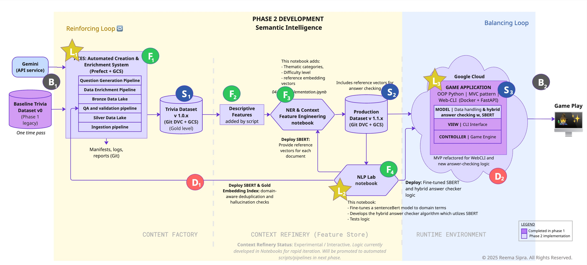
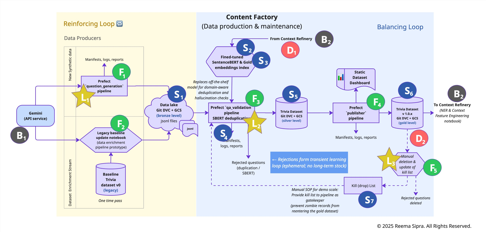

# Applied system thinking case-study

**Project: Semantic Verification Engine (Intelligent Trivia Platform)** 
**Author: Reema Sipra** 

---

This document is a deep-dive systems-thinking exploration intended for learning, traceability, and future reference.

1. [**System thinking analysis**](#a-system-thinking-analysis) 
&emsp;∙ [Platform (level 0)](#11-platform-level-0) 
&emsp;∙ [Subsystem (level 1)](#12-subsystems-level-1) 
2. [**Sensitivity analysis**](#2-sensitivity-analysis)
3. [**Lessons learned**](#3-lessons-learned)

# 1: System Thinking Analysis
## 1.1: Platform (level 0)
• **Design:** Phase 2 critical path 
• **Scope of analysis:** Platform (end-to-end).  
• **Analysis Goal**: Consider behaviour of the platform against design constraints from generation to runtime handoff, at different **growth scales**.

**Figure 1:** Design schematic marked with the system thinking elements for the full Platform (level 0). 

The following table describes the labelled entities from the scehmatic. 
*Note*: System labels ($S_x, F_x$) are scoped locally to each level of analysis (platform vs subsystem). 

|Subscript \ Label| **B** (Boundary)| **S** (Stock) | **F** (Flow) | **L** (Lever) | **D** (Delay) | 
|-|-|-|-|-|-|
| **1** | B1: External Data Sources (Gemini API, Legacy SQL)|S1: Gold Trivia Dataset (accumulated asset)| F1: question generation flow|L1: Prompt constraints|D1: SBERT modelling delay (intelligence lag) → not dominant at platform scale.|
| **2** |B2: User environment (game play) |S2: Runtime capacity (active container instances) | F2: Descriptive features (length, type category etc)| L2: NLP lab notebook (intelligence multiplier)|D2: Observability Lag (time to detect capacity overflow/breach)|
| **3** |- |S3: Production dataset (passthrough state / not affected)| F3: Adding NER context (thematic tagging)| L3: Runtime architecture (scalability strategy)||
| **4** |-|-|F4: Intelligence transfer (SBERT model deployment)|-|-| 

### Behaviour analysis: Limits to growth dynamic

**Goal**: characterize how the architecture transitions from *zero-cost development to paid scaled production* by analyzing the stress on the *runtime capacity ($S_3$)*.

**Influential behavioural dynamics**: 

1. **Value creation chain (reinforcing tendency)**.  [**F1 → S1**]: Automated question generation using LLM. 
*Behaviour:* LLM high-quality question generation → more question variety → gain user trust and interest.
2. **Balancing loop**. [**S3**]: Game runtime environment operating constraints.  
*Behaviour:* User base grows → more container instances required → instances approach cloud-run free-tier.  

**System modes analysis**

| | **Mode 1: Safe**  (within operating limits of free-tier cloud run)| **Mode 2: Overshoot**  (exceed free-tier limits)|
|-|-|-|
|Condition| User demand ($B_2$) < free-tier limit| User demand ($B_2$) > free-tier limit|
|**Behavior**|
|⁃ Dominant loop| Reinforcing (growth)| Balancing (runtime constraints) loop|
|⁃ $S_3$ State| Stable. Container spins down to zero instances| Stressed. Moves beyond free-tier limits; running 24/7.|
|⁃ Delay, $D_2$  (lag in observation)|handled within runtime constraints |**Risk of overshoot**. Because of the combined observability and reaction lag (billing delays + manual admin intervention), the runtime can operate at cost for a time without being detected, leading to unexpected and excessive costs (e.g. sudden spike in interest)|
|⁃ Lever strategy| $L_1$ (Growth): maximize throughput to rapidly fill the Trivia dataset ($S_1$) with high-quality questions|$L_3$ (Resilience): adapt runtime architecture to be stable at scale. Capacity management: 1. circuit breaker for safety (e.g. hard instance limits), 2. load handling|

### Level 0 analysis takeaways / implications
1. **Growth vs risk**: Platform follows the *limits to growth* pattern. Need to plan for a step up in runtime architecture from free-tier to a robust paid strategy if there is demand that manages opex with performance. There is also a risk of sudden expenditure because of lag in observation ($D_2$).
2. **Safety measures are required**: Circuit breakers need to be implemented even at demo stage for unplanned usage spikes.
3. **Benefit of decoupled runtime**: allows for data generation and improvements / retraining of the SBERT models ($F_4$) without impacting the latency or stability of the live game environment.

## 1.2: Subsystems (Level 1)
### Scope Framing
• **Design:** Phase 2 critical path 
• **Scope of analysis:** Content Factory (data generation → validation → asset).  
• **Analysis Goal**: Consider behaviour of the Content Factory **quality** at different scales (yield), from generation to runtime handoff.

**Figure 2:** Design schematic marked with the system thinking elements for the full Platform (level 0). 

The following table describes the labelled entities from the schematic. 
*Note*: System labels ($S_x, F_x$) are scoped locally to each level of analysis (platfrom vs subsystem). 

|Subscript \ Label| **B** (Boundary)| **S** (Stock) | **F** (Flow) | **L** (Lever) | **D** (Delay) | 
|-|-|-|-|-|-|
| **1** | B1: Google Gemini API service (external generator)| S1: Raw question data lake (accumulation) | F1: Question generation pipeline (sourcing) | L1: Prompt Engineering (quality control)|D1: SBERT Training Lag. High latency is acceptable here. After initial fine-tuning step change, improvements are incremental, allowing for cost-efficient batched updates.|
| **2** | B2: Context refinery (target subsystem)| S2: Validation decision logic (model + thresholds)| F2: Legacy ingestion (one-time run) | L2: Validation criteria (gatekeepers) |D2: Manual deletion of errors based on user feedback & update of the kill list (remediation lag)|
| **3** |-|S3: Gold embedding index for deduplication (accumulation)| F3: QA & validation pipeline (filtering and cleaning)| L3: Manual correction policy (safety net)|-|
| **4** |-|S4: Pipeline artifacts (manifests, logs, reports) as audit trail (passive accumulation) |F4: Publisher pipeline (promotion to Gold) |-|-|
| **5** |-|S5: Silver (staging) dataset (accumulation);/ not affected by scenario, added for completeness |F5: Error correction loop (manual deletion, kill list update)|-|-|
| **6** |-|S6: Gold trivia dataset (accumulation) |-|-|-|
| **7** |-|S7: Kill list (accumulation) |-|-|-|

### Behaviour analysis: The Quality vs. Saturation dynamic

**Goal**: Characterize how the Content Factory behaves as the source material ($S_{Sources} \approx 7 \text{ books}$) is exhausted. Unlike the Platform (which is limited by Cost), the Factory is limited by Quality (Uniqueness & Accuracy).

**Influential behaviour dynamics**: Bounded-growth 
1. **Balancing loop**. [**F3 → F4**]: Filtering and validating the generated questions to limit errors entering the Gold dataset. QA caps error growth but does not eliminate it by design.  
*Behaviour:* QA rejection → reduced inflow to Gold dataset → stabilize data purity.  
2. **Delayed balancing loop**. [**F5 → S4**]: Manual corrections by deleting questions flagged by Player feedback. 
*Behaviour:* user feedback → manual deletion → error suppression  
3. **Reinforcing loop**.  [**F1 → S1**]: Automated data generation using LLM. 
*Behaviour:* Automation (reduces generation friction) + high-quality (LLM) → more content → more value

**System modes analysis**

| | **Mode 1: Greenfield (growth)**| **Mode 2: Dataset Saturation (maturity)**|
|-|-|-|
|Condition| Gold dataset size ($S_6$) << Source potential (low coverage) User Base: Small (Demo)| Gold dataset size ($S_6$) $\approx$ Source potential (high coverage) User Base: Large (Production)|
|**Behavior**|
|⁃ Dominant loop| Reinforcing (high yield). Most generated questions are new and valid| Balancing (diminishing returns). Most generated questions are duplicates or low-quality edge cases|
|⁃ $S_6$ State| **Exposure risk**. the dataset grows while a small, bounded error rate accumulates that were missed (by $L_1, L_2$). The sampling ratio is high per session (small dataset), the probability of a flawed session increases with error accumulation which can undermine user experience and trust| Exposed Risk vs. Active Correction. The dataset size will stabilize with proportional errors accumulated. This can lead to comparable or higher exposure probability but it also activates correction from D2.|
|⁃ Primary bottleneck| Hallucination rate ($L_1$). The main risk is generating falsehoods|Uniqueness ($S_3$). The main risk is generating duplicates.|
|⁃ Delays|
|&emsp; *SBERT stability ($D_1$)*|High Gain. Initial fine-tuning provides a *step change* in capability | Stable / Low drift. Source material is static. Retraining yields diminishing returns ($D_1$ is non-critical)|
|&emsp; *User Feedback signal ($D_2$)*|Silent / unreliable . Low volume allows for manual review ($L_3$), but the error signal is weak and slow to act as a control loop. Errors can persist for a long time.|**High exposure & critical**. Finite source content + high concurrency means errors are highly visible. Feedback acts as a trigger: aggregated flags (e.g., 5 counts/question) must automate question quarantine (via $L_3$). This isolates the content from the game immediately while preserving it for analysis later|
|⁃ Lever strategy|$L_1$ (prompting): Tighten constraints to filter hallucinations at the source (*prevention*)|$L_2$ (validation): Increase semantic similarity criteria to reject near-duplicates more aggressively|

### Level 1 analysis takeaways / implications

1. **SBERT training economics ($D_1$)**:The transition from the pre-trained model to the fine-tuned state represents a step change in capability. Subsequent updates give marginal gains (incremental linear improvements).  *Implication*: tight feedback loop for model retraining is not needed. $D_1$ can be matched to generation runs (batched infrequent updates) to reduce operational effort (later cost). And since the source material is static, risk of domain drift across updates is negligible.
2. **User feedback signal is dynamic** and it strength and validity grows with scale. Sudden, temporary, event-based surges are also possible (e.g. link shared by influencer)  *Implications*: Automation should be planned with growth. 
3. **Correction with user feedback at demo-scale is not practical**: In Mode 1 (growth), the user feedback ($D_2$) is too low to create a viable correction signal because not enough users are playing the game. So an error might exist in the Gold dataset for months before being spotted. 
*Implications*: Active quality checks are required (e.g. sequential acceptance sampling) for each batch generated rather than waiting for users to flag them.
4. **Trust / Reputation risk**: because of the small dataset size, the chance of a user coming across an incorrect question are high which can affect Player interest and trust in the game. 
*Implications*: L1, L2 need to minimize errors before they get to the dataset S6. The game sessions size (question num) should be carefully selected with this in mind.  

---

# 2: Sensitivity Analysis 

**Goal**: Translate the System Thinking findings into actionable performance targets for the implementation phase.

## TL;DR: Summary
The analysis revealed the following targets

1. Hallucination rate target ≈ 1% to maintain user trust and keep downstream correction mechanisms viable.
2. Session size ~ 15 questions to further limit user exposure to residual errors in gameplay.
3. Active QA strategies for demo (sequential acceptance sampling) after each question generation batch.
4. User feedback correction signal at demo scale is weak and should not be used as the primary method for correction. Consider a shift-left, and introduce active quality control after every new batch of generated questions (e.g. sequenced acceptance sampling).
5. User feedback signal for correction becomes reliable as a safety-net only at larger scales (~100+ game sessions per day). Provisions for incorporating user feedback should therefore be included in the Phase 2 design, with staged strategies that evolve from demo to full-scale operation.

<strong> Expand to see high level estimate calculations</strong>

## 1. Error accumlation within the Gold dataset

**Question 1**: *What happens to the dataset as the hallucinations missed with each batch generation are missed by the layered defensive quality assurance design and accumulate withing the Gold dataset?*

**Ans. 1**: An error rate of 3% or below is tolerable at the dataset level, resulting in a purity of ~97.5% (see analysis below). Errors accumulate but remain bounded and do not degrade the dataset as a whole.

**Basis for estimate**:
1. **Hallucination rate** (extreme stress limit): 10%
2. **Scenarios to consider**: We can perform a quick sensitivity analysis on how the hallucinations gather based on the effectiveness of the `qa_validation` pipeline (that will use an SBERT hallucinatin checker)

    |Scenario|Definition|Efficiency|Impact per 1,000 Generated|
    |-|-|-|-|
    A|Optimistic|80% Removal|100 Bad Qs → 20 Leak / 80 Caught
    B|Conservative|50% Removal|100 Bad Qs → 50 Leak / 50 Caught
    C|Baseline|0% Removal|100 Bad Qs → 100 Leak (No Validation)

**Analysis**

Step|Batch Action|Total Good|Total Bad|Total Inventory|Error Rate|Purity
|-|-|-|-|-|-|-|
Start|Baseline (Hand-verified)|920|0|920|0.00%|100%
Batch 1|Add 2,000 (Scenario A) (80% eff: 40 leaks)|2,720|40|2,760|1.45%|98.6%
Batch 2|Add 2,000 (Scenario B) (50% eff: 100 leaks)|4,520|140|4,660|3.00%|97.0%
Batch 3|Add 1,000 (Scenario B*) (Conservative: 100 leaks)|5,420|240|5,660|4.24%|95.8%

If we repeat the analysis with lower hallucination rates and look at the purity after the addition of the same 3 batches (5,420 questions in total), at:
- ✅ **Target** (1% hallucination rate): purity is **99.2%%** (accumulated error: 110 questions)
- ⚠️ **Drift** (3% hallucination rate): purity is **97.5%** (accumulated error: 150 questions)
- 🛑 **Extreme** (10% hallucination rate): purity is **95.8%** (accumulated error: 240 questions)

### 2. Effect of hallucinations on user experience
#### Question 2: *How do hallucinations effect game play?*

**Ans. 2:  The analysis suggests targeting a ~1% hallucination rate.** At this level, users encounter an incorrect question in roughly one out of six games; higher error rates quickly make flaws noticeable and erode trust. Reducing session length (e.g. 15 questions) further lowers exposure to ~10% per game, improving perceived quality.

**Note:** Based on experiment runs for the `question_generation` prompting this is [achievable](../notebooks/02_research/03_aces_generating_new_questions/03-1_prompt_eng_experimentation.ipynb). The prompts are strongly grounded in the source-text. So of the ~60 generated questions from 2 chapters,  0 hallucinations were observed. The pilot run will with a single book will provide a more accurate estimate for hallucination.

**Basis for estimate**:
- **Baseline dataset v0**: 902 questions (100% correct)
- **Input (Generation)**: 2,000 questions with **X%** hallucinations
- **Questions per session**: 25 questions.

|Metric|1% Hallucination (Target)|3% Hallucination (Drift)|10% Hallucination (Extreme)|
|-|-|-|-|
|Bad Questions in Pool|20|60|200|v
|Effective Dataset Error Rate (e)|0.69%|2.07%|6.89%|
|Est. Probability of a flawed session <!--(P=1-(1-e)^n)-->|~16%|~41%|~83%|
How many games have errors|	1 of 6 games|2.5 of 6 games|	5 of 6 games
Total Errors Encountered|	~1 error total|	~3 errors total|	~10 errors total|
|**Mitigated risk(with 15 Q/session)**|~10%  (1 in 10 games)|~27%  (1 in 4 games)|~66%  (2 in 3 games)|

### 3. User feedback for correction
The user feedback is dynamic; is dependent on runtime so also on the scale of the game. It is the last-layer of defence that requires filtering / processing before it can be used to modify the Gold dataset.

**Question 3**: *If a bad question is missed by upstream validation, how long does it survive before the players report it?*

**Ans. 3: User feedback is a weak correction signal at the demo stage.**
At low volumes, user feedback is too sparse to function as a reliable control mechanism. At the demo scale (~20 games/week), an error that slips upstream validation is expected to take  ~265 days to reach a removal threshold (e.g. five independent reports). Therefore, during early stages, feedback should be handled manually and immediately. User feedback only becomes a reliable safety net at higher scales (~100+ game sessions per day), where reporting frequency increases enough to support automated correction.

**Analysis**: We can perform a sensitivity analysis looking at different scales of the game, calculate the liklihood they see and then report it. 

**Basis for estimate**:
- **Questions per session**: 25 questions.
- **Likelihood user will report error**: 30% (optimistic)
- **Number of reports per question to remove (circuit-breaker)**: 5 reports per question
- **Hallucination rate**: 1%

**Sensitivity Analysis** growth of the game from the realistic demo stage to viral as an experiment.

||Metric|Description|Zone 0: Demo|Zone 1: Mid|Zone 2: Growth|Zone 3: Scale|Zone 4: Limit|
|-|-|-|-|-|-|-|-|
A|Active Users|Input  *(game plays)*|5 / day|50 / day|100 / day|1000 / day|10,000 / day
B|Question Pool|Input *(dataset size)*|2,000 Qs|2,500 Qs|3,000 Qs|4,000 Qs|5,000 Qs|
C|Daily Impressions|Total num. questions seen *(A * Questions per sesson)*|125|1,250|2,500|25,000|250,000|
D|Inventory Turn|Chance of seeing a specific question *(C/B)*|0.06 / day|0.50 / day|0.83 / day|6.25 / day|50 / day
|E|Reports per Bad Q|Given question being viewed is *bad*, chance user will report (D * 30%)|0.02 / day|0.15 / day|0.25 / day|1.9 / day|15 / day
|F|Defect Survival Time|How long does a bad question go undetected? Circuit-breaker = 5 reports. *(Circuit-Breaker / E)*|~266 Days|~33 Days|~20 Days|~2.6 Days|~8 Hours|
||**User Correction Feedback signal strength**||🔴 Too weak|🟠 Risky | 🟠 Risk|🟢 Reliable|🟢 Reliable|

 

**Question 4**: *How do the operations change to handle user feedback as the game scales?*

**Ans. 4: Requires different handling at different growth scales.** A staggered approach from immediate triggers (at demo), batched notifications (zone 1, 2), automated with aggregation at (zone 4) because there is high volume but also high noise, to immediate automated actions to prevent flooding (zone 5). The ciruit-breaker requirement will also change with different zones.

The table relies on the table above (*Ans 3*) for calculations.

||Metric|Description|Zone 0: Demo|Zone 1: Mid|Zone 2: Growth|Zone 3: Scale|Zone 4: Limit|
|-|-|-|-|-|-|-|-|
A|Active Users|Input  *(game plays)*|5 / day|50 / day|100 / day|1000 / day|10,000 / day
|G|Total System Tickets|Chance a game has an error and user reports it *(C * 1% (Hallucination rate) * 30%)*|0.4 / day|3.7 / day|7.5 / day|75 / day|750 / day
||**User Correction Feedback handling required**||🟢 manual|🟢 manual|🟢 manual| 🟠 Automated (aggregated analysis)|🔴 Automated (tag to quarantine)|

---

# 3: Lessons Learned

1. **An MVP 0 before MVP 1 would have reduced early complexity.**
Introducing an explicit MVP 0, ahead of the current MVP, would have allowed the project to evolve first as a lightweight product experiment rather than a system. A simple prototype, such as prompting a foundational model to generate a small set of questions and act as an intelligent game master, could have validated the core value proposition within a week. This would have surfaced critical constraints early: player enjoyment, trust in generated content, tolerance for hallucinations, and whether users value the trivia itself or the game master experience more.

    *Context:* The project originally started as a learning-focused exploration of NLP and semantic verification techniques rather than as a product experiment. As a result, architectural and system considerations were introduced earlier

2. **Upfront systems analysis should be applied selectively and early.**
Not all projects warrant the same level of upfront systems thinking. Lightweight or bounded prototypes can often move directly into implementation. However, projects with unbounded operating costs (e.g., API-driven or agentic systems), hard cost thresholds, or delayed feedback loops benefit from early systems-thinking analysis — especially before irreversible architectural decisions are locked in. Even a qualitative pass can reveal where costs, errors, or complexity may grow unchecked.

3. **User feedback steers the product; Architecture stabilizes the platform.**
Early user interest and feedback should be treated as primary design constraints. Architecture provides a high-level roadmap, but frequent, lightweight feedback loops are what keep a project aligned with its intended direction as it evolves.

4. **Bring focus to the dominant entities in the schematics.**
The system schematics here are intentionally dense. This pass was used to identify and classify potential stocks, flows, delays, and levers. This helped build core understanding and intuition on how to approach system thinking. However, while running behavioral scenarios, it became clear that only some of the elements dominate outcome for the given scenario. A second pass should refine the schematic to show only the core driving elements for better clarity and effectiveness.
